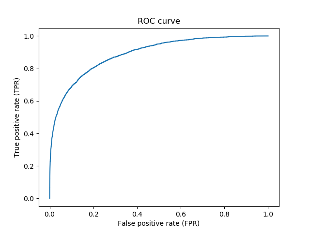
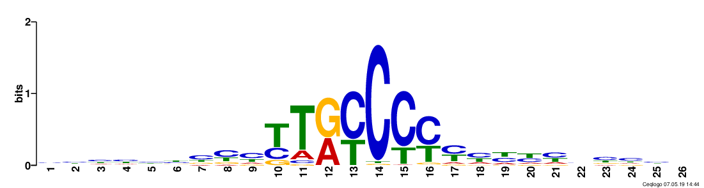

document.querySelector('title').textContent = 'DanQ: a hybrid convolutional and recurrent deep neural network for quantifying the function of DNA sequences ';
**DanQ: a hybrid convolutional and recurrent deep
neural network for quantifying the function of DNA sequences** 


|  |
| --- |
| 
Quick Links
[Documentation](#doc)
[Notes](#notes)
[Interactive job](#int) 
[Batch job](#sbatch) 
[Swarm of jobs](#swarm) 
 |


DanQ is a hybrid convolutional and bi-directional long short-term
memory recurrent neural network framework for predicting
non-coding function de novo from sequence.   
   

This application is being used as a biological example in class #2 of the course
"Deep Learning by Example on Biowulf".


### References:


* Daniel Quang and Xiaohui Xie, 
 *DanQ: a hybrid convolutional and recurrent deep
neural network for quantifying the function of DNA
sequences*   

[Nucleic Acids Research,](https://academic.oup.com/nar/article/44/11/e107/2468300) 2016, Vol. 44, No. 11 e107; doi: 10.1093/nar/gkw226


Documentation
* [DanQ page on GitHub](https://github.com/uci-cbcl/DanQ)


Important Notes
* Module Name: DanQ (see [the modules page](https://hpc.nih.gov/apps/modules.html) for more information)
* Unusual environment variables set
	+ **DANQ\_HOME**  DanQ installation directory
	+ **DANQ\_BIN**       DanQ executable directory
	+ **DANQ\_SRC**     DanQ source code
	+ **DANQ\_DATA**    DanQ data folder


Interactive job
[Interactive jobs](/docs/userguide.html#int) should be used for debugging, graphics, or applications that cannot be run as batch jobs.
Allocate an [interactive session](/docs/userguide.html#int) and run the program. Sample session:


```

[user@biowulf]$ **sinteractive --mem=96g --gres=gpu:v100x,lscratch:10 --cpus-per-task=14**
[user@cn4466 ~]$**module load DanQ** 
[+] Loading cuDNN/8.0.3/CUDA-11.0 libraries...
[+] Loading CUDA Toolkit  11.0.3  .... 
[+] Unloading meme  5.1.0  on cn2358
[+] Loading openmpi 2.1.1  for GCC 4.8.5
[+] Loading weblogo  3.6 
[+] Loading DanQ 20210407  ... 

```

(a lower-case name, danq, for the module will also work).   
   

The code comprises three executables: train.py, predict.py and visualize.py. To display a usage message for a given executable, type its name, followed by the option "-h". To example:

```

[user@cn4466 ~]$ **train.py -h**
usage: train.py [-h] [-b batch_size] -d data_folder [-e num_epochs] [-f start_filters] [-g num_gpus]
                [-k kernel_size] [-l learning_rate] [-m model_name] [-M] [-n debug_size]
                [-o test_results] [-O optimizer] [-s] [-v] [-w]

optional arguments:
  -h, --help            show this help message and exit
  -b batch_size, --bs batch_size
                        batch size; default=500
  -e num_epochs, --num_epochs num_epochs
                        number of epochs; default=60
  -f start_filters, --start_filters start_filters
                        number of filters used in the (1st) convolution layer; default=320
  -g num_gpus, --num_gpus num_gpus
                        number of gpus to use; default=1
  -k kernel_size, --kernel_size kernel_size
                        conv. kernel size; default=26 for DanQ and =8 for DeepSEA model
  -l learning_rate, --lr learning_rate
                        learning rate; default=1.e-4
  -m model_name, --model_name model_name
                        model name: DanQ | DeepSEA
  -M, --motif_sequences
                        predict motif sequences, rather than target labels
  -n debug_size, --num_debug_data debug_size
                        number of training examples to use when debugging
  -o test_results, --output test_results
                        output file with test results; default='test_results.h5'
  -O optimizer, --optimizer optimizer
                        optimizer: adam | rmsprop | sgd
  -s, --schedule        vary the learning rate according to a schedule
  -v, --verbose         increase the verbosity level of output
  -w, --load_weights    read weights from a checkpoint file

required arguments:
  -d data_folder, --data_folder data_folder
                        path to the data folder

```

This code comprises two network models: DanQ and DeepSEA. In order to perform training any model, first download available sample data:

```

[user@cn4466 ~]$ **cp -r $DANQ\_DATA/\* .**

```

This command will copy to your current directory   

- folder "data" that contains sample input data for DanQ,   

- folder "checkpoints" that stores the pre-computed checkpoint files, and   

- folder "predictions" with sample predicted results.   
  

The following command will train the (default) DanQ model on the (default) data stored in the MAT file data/train.mat:

```

[user@cn4466 ~]$ **train.py -d data**
...
Epoch 1/60
4400000/4400000 [==============================] - 3248s 738us/step - loss: 0.0759 - val_loss: 0.0629
Epoch 2/60
4400000/4400000 [==============================] - 3312s 753us/step - loss: 0.0677 - val_loss: 0.0574
Epoch 3/60
4400000/4400000 [==============================] - 3253s 739us/step - loss: 0.0652 - val_loss: 0.0560
Epoch 4/60
4400000/4400000 [==============================] - 3142s 714us/step - loss: 0.0635 - val_loss: 0.0547
Epoch 5/60
4400000/4400000 [==============================] - 3134s 712us/step - loss: 0.0624 - val_loss: 0.0542
Epoch 6/60
4400000/4400000 [==============================] - 3136s 713us/step - loss: 0.0616 - val_loss: 0.0545
...

```

The training will take approx. 50 min per one epoch when one GPU V100 is used. The result of the training (i.e. a checkpoint file) will be stored in the folder "checkpoints", in HDF5 format. The name of the checkpoint file will be

```

checkpoints/<.out_prefix>.<model_name>.h5.

```

or, in this particular case, danq.DanQ.h5.   

To train another model on the same data, specify the model name with command line option -m. For example:

```

[user@cn4466 ~]$ **train.py -d data -m DeepSEA**
...

```

The command line options for the prediction code are:

```

[user@cn4466 ~]$ **predict.py -h**
...
usage: predict.py [-h] -d data_folder [-f start_filters] [-k kernel_size] [-m model_name] [-M]
                  [-o test_results]

optional arguments:
  -h, --help            show this help message and exit
  -f start_filters, --start_filters start_filters
                        number of filters used in the (1st) convolution layer; default=320
  -k kernel_size, --kernel_size kernel_size
                        conv. kernel size; default=26 for DanQ and =8 for DeepSEA model
  -m model_name, --model_name model_name
                        model name: DanQ | DeepSEA
  -M, --motif_sequences
                        predict motif sequences, rather than target labels
  -o test_results, --output test_results
                        output file with test results; default='test_results.h5'

required arguments:
  -d data_folder, --data_folder data_folder
                        path to the data folderUsing TensorFlow backend.


```

To make predictions of the target labels with model DanQ on the testing data stored in the MAT file data/test.mat and using a pre-trained checkpoint file, type 

```

[user@cn4466 ~]$ **predict.py -d data** 
...
455024/455024 [==============================] - 982s 2ms/step

```

With this command, the predict.py code will 
output the predicted results in the file test\_results.h5.   

In order to visualize the predicted ROC curves for any of one of available 919 targets, 
run the executable visualize.py,   


```

[user@cn4466 ~]$ **visualize.py -h** 
Using TensorFlow backend.
usage: visualize.py [-h] [-f start_filters] [-M] -t target_id

optional arguments:
  -h, --help            show this help message and exit
  -f start_filters, --start_filters start_filters
                        number of filters used in the (1st) convolution layer;
                        default=320
  -M, --motif_sequence  visualize a motif sequence, rather than a ROC curve

required arguments:
  -t target_id, --target target_id
                        integer in the interval [1,919] for visualizing a ROC
                        curve and in [1,start_filters] for visualizing a motif sequence

```

together with the option -t to specify a particular target. For example:

```

[user@cn4466 ~]$ **visualize.py -t 1** 

```


  

To make predictions of motif sequences, first run predict.py with the option -M:

```

[user@cn4466 ~]$ **predict.py -M -d data**

```

This command will produce a file motifs.txt. Then vusualize a particular motif 
by providing its id with -t option. For example:

```

[user@cn4466 ~]$ **visualize.py -M -t 43** 

```


  

In order to train the DanQ code using **multiple GPUs**,   

- allocate a session with appropriate number of GPUs (you are allowed to use up to 4 GPUs per session),   

- specify through a command line option -g how many GPUs you want to use, and   

- specify a batch size that is multiple of the number of GPUs you will be using.   

For example:

```

[user@cn4471 ~]$ **exit**
[user@biowulf ~] **sinteractive --mem=64g --gres=gpu:v100:4,lscratch:100 --cpus-per-task=14** 
[user@cn4471 ~]$ **module load danq** 
[user@cn4471 ~]$ **cp -r $DANQ\_DATA/\* .**
[user@cn4471 ~]$ **train.py -d data -g 4 -b 2000** 

```

End the interactive session:

```

[user@cn4466 ~]$ **exit**
salloc.exe: Relinquishing job allocation 46116226
[user@biowulf ~]$

```

Batch job
Most jobs should be run as [batch jobs](/docs/userguide.html#submit).
Create a batch input file (e.g. danq.sh). For example:


```

#!/bin/bash
module load DanQ 
cp -r $DANQ_DATA  .
train.py        

```

Submit this job using the Slurm [sbatch](/docs/userguide.html) command.


```
sbatch [--cpus-per-task=#] [--mem=#] danq.sh
```


