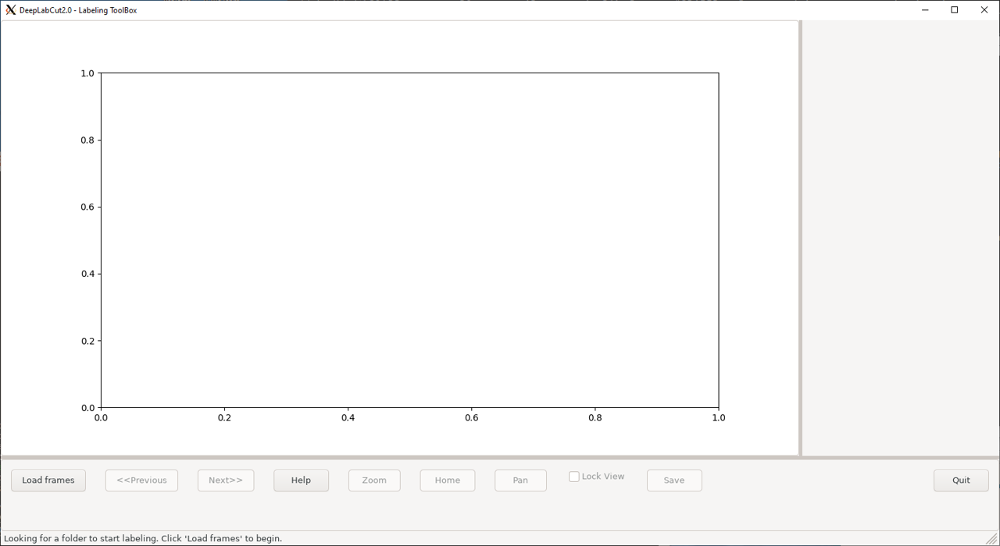

document.querySelector('title').textContent = 'DeepLabCut: Markerless pose estimation of user-defined features with deep learning for all animals, including humans ';
**DeepLabCut: Markerless pose estimation of user-defined features with deep learning for all animals, including humans** 


|  |
| --- |
| 
Quick Links
[Documentation](#doc)
[Notes](#notes)
[Interactive job](#int) 
[Batch job](#sbatch) 
[Swarm of jobs](#swarm) 
 |


DeepLabCut is an open source toolbox
that builds on a state-of-the-art animal pose estimation algorithm.
It allows training of a deep neural network by using limited training data 
to precisely track user-defined features, so that the human labeling accuracy will be matched.


### References:


* Alexander Mathis, Pranav Mamidanna, Kevin M. Cury, Taiga Abe, Venkatesh N. Murthy,
Mackenzie Weygandt Mathis and Matthias Bethge,   

*DeepLabCut: markerless pose estimation of user-defined body parts with deep learning.*   

[Nature Neuroscience v.21, p.1281–1289 (2018)](https://www.nature.com/articles/s41593-018-0209-y)* T.Nath, A.Mathis, A.C.Chen, A.Patel, M.Bethge, and M.W.Mathis,   

*Using DeepLabCut for 3D markerless pose estimation across species and behaviors.*   

[bioRxiv Nov. 24, 2018; doi: http://dx.doi.org/10.1101/476531](https://www.biorxiv.org/content/10.1101/476531v1)* Alexander Mathis, Mert Yüksekgönül, Byron Rogers, Matthias Bethge, Mackenzie W. Mathis,   

*Using DeepLabCut for 3D markerless pose estimation across species and behaviors.*   

[arXiv:1909.11229](https://arxiv.org/abs/1909.11229)


Documentation
* [DeepLabCut User Overview Guide](https://github.com/DeepLabCut/DeepLabCut/blob/master/docs/UseOverviewGuide.md)
* [DeepLabCut Home page](https://pypi.org/project/deeplabcut/)
* [DeepLabCut GitHub page](https://github.com/AlexEMG/DeepLabCut)
* [DeepLabCut video tutorial](https://www.youtube.com/watch?v=7xwOhUcIGio)


Important Notes
* Module Name: DeepLabCut (see [the modules page](https://hpc.nih.gov/apps/modules.html) for more information)
* Unusual environment variables set
	+ **DLC\_MODEL**  include pretrained model, has to be copied to /data/$USER


Interactive job
[Interactive jobs](/docs/userguide.html#int) should be used for debugging, graphics, or applications that cannot be run as batch jobs.
  

The DeepLabCut application installed on Biowulf is supposed to be run using GPU. 
As the first step, please allocate an [interactive session](/docs/userguide.html#int):


* deeplabcut/2
* deeplabcut/2.3.4


Interactive use of DeepLabCut via the GUI requires a 
[graphical X11 connection](https://hpc.nih.gov/docs/connect.html).   

Both NX and MobaXterm work well for Windows users,   
 while XQuartz works well for Mac users.


```

[user@biowulf]$ **sinteractive --gres=gpu:p100:1,lscratch:10 --mem=20g -c14**
[user@cn4469 ~]$ **module load DeepLabCut/2.2.2** 
[+] Loading singularity  3.10.0  on cn3063
[+] Loading CUDA Toolkit  11.2.2  ...
[+] Loading cuDNN/8.1.0.77/CUDA-11.2.2 libraries...
[+] Loading DeepLabCut  2.2.2

```

Clone the DeepLabCut GitHub repository, which contains some examples:

```

[user@cn4469 user]$ **mkdir -p /data/$USER/DLC && cd /data/$USER/DLC**
[user@cn4469 user]$ **cp -r $DLC\_MODEL/pretrained .**
[user@cn4469 user]$ **git clone https://github.com/AlexEMG/DeepLabCut**
[user@cn4469 user]$ **cd DeepLabCut**

```

Checkout the version with specific tag corresponding to the version of the module you loaded: 

```

[user@cn4469 user]$ **git checkout tags/v2.2.2**
...
HEAD is now at 2f5d328... DLC 2.2.2 

```

The repository contains several videos:

```

[user@cn4469 ~]$ **ls examples/\*/videos/\*** 
examples/openfield-Pranav-2018-10-30/videos/m3v1mp4.mp4
examples/Reaching-Mackenzie-2018-08-30/videos/MovieS2_Perturbation_noLaser_compressed.avi
examples/Reaching-Mackenzie-2018-08-30/videos/reachingvideo1.avi

```

Use these data in an interactive python session:

```

[user@cn4469 ~]$ **ipython**
Python 3.8.10 (default, Jun 22 2022, 20:18:18)
Type 'copyright', 'credits' or 'license' for more information
IPython 8.4.0 -- An enhanced Interactive Python. Type '?' for help.

**In [1]: import deeplabcut**

**In [2]: config\_path = deeplabcut.create\_new\_project("MyFirstProject", "Me", ["examples/Reaching-Mackenzie-2018-08-30/videos/MovieS2\_Perturbation\_noLaser\_compressed.avi", "examples/Reaching-Mackenzie-2018-08-30/videos/reachingvideo1.avi"], '.', copy\_videos=True)**
Created "/gpfs/gsfs7/users/user/DeepLabCut/test_dir/DeepLabCut/MyFirstProject-Me-2022-08-31/videos"
Created "/gpfs/gsfs7/users/user/DeepLabCut/test_dir/DeepLabCut/MyFirstProject-Me-2022-08-31/labeled-data"
Created "/gpfs/gsfs7/users/user/DeepLabCut/test_dir/DeepLabCut/MyFirstProject-Me-2022-08-31/training-datasets"
Created "/gpfs/gsfs7/users/user/DeepLabCut/test_dir/DeepLabCut/MyFirstProject-Me-2022-08-31/dlc-models"
Copying the videos
...
A new project with name MyFirstProject-Me-2022-08-31 is created at /gpfs/gsfs7/users/user/DeepLabCut/test_dir/DeepLabCut and a configurable file (config.yaml) is stored there. Change the parameters in this file to adapt to your project's needs.
 Once you have changed the configuration file, use the function 'extract_frames' to select frames for labeling.
. [OPTIONAL] Use the function 'add_new_videos' to add new videos to your project (at any stage).
**In [3]: deeplabcut.extract\_frames(config\_path,"automatic","uniform")**
...
Config file read successfully.
...
Extracting frames based on uniform ...
Uniformly extracting of frames from 0.0  seconds to 8.53  seconds.

Frames were selected.
You can now label the frames using the function 'label_frames' (if you extracted enough frames for all videos).
**In [4]: deeplabcut.label\_frames(config\_path)** 

```


  
  
...

```

In [5]: **quit()** 

[user@cn4469 ~]$ **exit**
salloc.exe: Relinquishing job allocation 46116226

```


- Deeplabcut/2.3.4 (available on biowulf) command lines should be run on gpu with python-DLC instead of python:

```

[user@biowulf]$ **sinteractive --gres=gpu:p100:1,lscratch:10 --mem=20g -c14**
[user@cn4469 ~]$ **module load DeepLabCut/2.3.4** 
[+] Loading singularity  3.10.5  on cn4469
[+] Loading DeepLabCut  2.3.4

```
- It is essential to create a module directory under /data/$USER/DLC and put the model there so that the program can have write right to the directory:

```

[user@cn4469 user]$ **mkdir -p /data/$USER/DLC && cd /data/$USER/DLC**
[user@cn4469 user]$ **cp -r $DLC\_MODEL/pretrained .**


```
- Clone the DeepLabCut GitHub repository, which contains some examples (optional):

```

[user@cn4469]$ **git clone https://github.com/AlexEMG/DeepLabCut**
[user@cn4469]$ **cd DeepLabCut/examples**

```

Test run in a terminal:

```

[user@cn4469]$ **python-DLC testscript.py**
[user@cn4469]$ **python-DLC testscript\_multianimal.py**

```

- deeplabcut GUI could to be opened through [NoMachine](https://hpc.nih.gov/docs/nx.html): 
 
```

       python-DLC -m "deeplabcut"
       
```
- deeplabcut GUI could also be opened through visual partition [svis](https://hpc.nih.gov/docs/svis.html) desktop session:
 
```

       vglrun python-DLC -m "deeplabcut"
       
```


