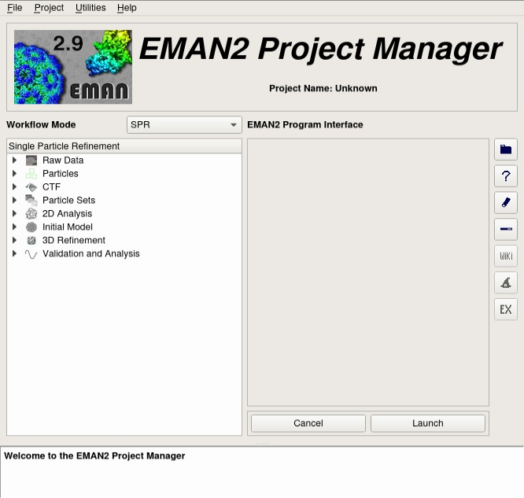
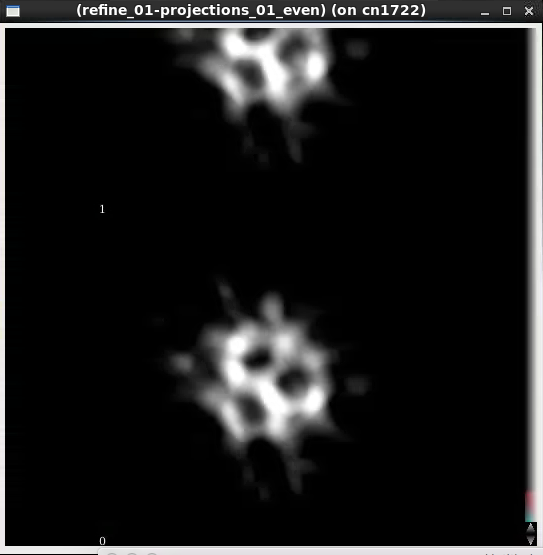

document.querySelector('title').textContent = 'EMAN2 on Biowulf';
EMAN2 on Biowulf


|  |
| --- |
| 
Quick Links
[Documentation](#doc)
[Notes](#notes)
[Interactive job](#int) 
[Batch job](#sbatch) 
 |


EMAN2 is the successor to EMAN1. It is a broadly based greyscale scientific image processing suite with a primary focus on processing data from transmission electron microscopes. EMAN's original purpose was performing single particle reconstructions (3-D volumetric models from 2-D cryo-EM images) at the highest possible resolution, but the suite now also offers support for single particle cryo-ET, and tools useful in many other subdisciplines such as helical reconstruction, 2-D crystallography and whole-cell tomography. Image processing in a suite like EMAN differs from consumer image processing packages like Photoshop in that pixels in images are represented as floating-point numbers rather than small (8-16 bit) integers. In addition, image compression is avoided entirely, and there is a focus on quantitative analysis rather than qualitative image display.


### References:


* G. Tang, L. Peng, P.R. Baldwin, D.S. Mann, W. Jiang, I. Rees & S.J. Ludtke.
[**EMAN2: an extensible image processing suite for electron microscopy.**](https://www.ncbi.nlm.nih.gov/pubmed/16859925)
*J Struct Biol. 157, 38-46 (2007).*
* J.M. Bell, M. Chen, P.R. Baldwin & S.J. Ludtke. 
[**High Resolution Single Particle Refinement in EMAN2.1.**](https://www.ncbi.nlm.nih.gov/pubmed/26931650)
*Methods. 100, 25-34 (2016).*
* Ludtke, S. J.
[**Single-Particle Refinement and Variability Analysis in EMAN2.1.**](https://www.ncbi.nlm.nih.gov/pubmed/27572727)
*Methods Enzymol 579159-189 (Elsevier, United States, 2016).*
* J.G. Galaz-Montoya, C.W. Hecksel, P.R. Baldwin, E. Wang, S.C. Weaver, M.F. Schmid, S.J. Ludtke & W. Chiu.
[**Alignment algorithms and per-particle CTF correction for single particle cryo-electron tomography.**](https://www.ncbi.nlm.nih.gov/pubmed/27016284)
*J Struct Biol. 194, 383-394 (2016).*


Documentation
* [EMAN2 main page](http://blake.bcm.edu/emanwiki/EMAN2)
* [Parallel Processing in EMAN2](http://blake.bcm.edu/emanwiki/EMAN2/Parallel)
* [Tutorials](http://blake.bcm.edu/emanwiki/EMAN2/Tutorials)
* [Sparx Wiki](http://sparx-em.org/sparxwiki/SparxWiki)


Important Notes
* Module Name: EMAN2 (see [the modules page](/apps/modules.html) for more information)
* Multithreaded/Singlethreaded/MPI
* environment variables set 
	+ EMAN2\_HOME
	+ EMAN2\_EXAMPLES
	+ LD\_LIBRARY\_PATH
	+ LIBGL\_ALWAYS\_INDIRECT* Example files in $EMAN2\_EXAMPLES, /fdb/app\_data/cryoem/EMAN2


This application requires an [X-Windows connection](/docs/connect.html). It is known that XQuartz (v2.7.x) is incompatible with EMAN2. Users are encouraged to use [NX or FastX](https://hpc.nih.gov/docs/nx.html) as their X11 servers.


Running on GPUs
EMAN2 can utilize GPUs to accelerate certain tasks.


```
[user@biowulf]$ sinteractive --gres=gpu:p100:1 ...
...
[user@node]$ module load EMAN2
```

Interactive job
[Interactive jobs](/docs/userguide.html#int) should be used for debugging, graphics, or applications that cannot be run as batch jobs.
Allocate an [interactive session](/docs/userguide.html#int) and run the program. Sample session:


```

[user@biowulf]$ **sinteractive**
salloc.exe: Pending job allocation 46116226
salloc.exe: job 46116226 queued and waiting for resources
salloc.exe: job 46116226 has been allocated resources
salloc.exe: Granted job allocation 46116226
salloc.exe: Waiting for resource configuration
salloc.exe: Nodes cn3144 are ready for job

[node]$ module load EMAN2
[node]$ e2projectmanager.py
```



```
[node]$ e2display.py my_image.hdf
```



```
[node]$ **exit**
salloc.exe: Relinquishing job allocation 46116226
[user@biowulf ~]$

```


Batch job
Most jobs should be run as [batch jobs](/docs/userguide.html#submit).
Create a batch input file (e.g. EMAN2.sh). For example:


```
#!/bin/bash
# set the environment properly
module load EMAN2

# always a good practice
export TMPDIR=/lscratch/${SLURM_JOB_ID}

# Run refinement.  Make sure to replace the input, output, and reference files,
# as well as any options needed.  This command is designed to run on 32 cpus
# threads each and storing temporary files in /lscratch/$SLURM_JOBID.

e2refine.py \
  --parallel=thread:**${SLURM\_CPUS\_PER\_TASK:=1}:/lscratch/${SLURM\_JOB\_ID}** \
  --input=bdb:sets#set2-allgood_phase_flipped-hp \
  --mass=1200.0 \
  --apix=2.9 \
  --automask3d=0.7,24,9,9,24 \
  --iter=1 \
  --sym=c1 \
  --model=bdb:refine_02#threed_filt_05 \
  --path=refine_sge \
  --orientgen=eman:delta=3:inc_mirror=0 \
  --projector=standard \
  --simcmp=frc:snrweight=1:zeromask=1 \
  --simalign=rotate_translate_flip \
  --simaligncmp=ccc \
  --simralign=refine \
  --simraligncmp=frc:snrweight=1 \
  --twostage=2 \
  --classcmp=frc:snrweight=1:zeromask=1 \
  --classalign=rotate_translate_flip \
  --classaligncmp=ccc \
  --classralign=refine \
  --classraligncmp=frc:snrweight=1 \
  --classiter=1 \
  --classkeep=1.5 \
  --classnormproc=normalize.edgemean \
  --classaverager=ctf.auto \
  --sep=5 \
  --m3diter=2 \
  --m3dkeep=0.9 \
  --recon=fourier \
  --m3dpreprocess=normalize.edgemean \
  --m3dpostprocess=filter.lowpass.gauss:cutoff_freq=.1 \
  --pad=256 \
  --lowmem \
  --classkeepsig \
  --classrefsf \
  --m3dsetsf -v 2

e2bdb.py -cF

```

Submit this job using the Slurm [sbatch](/docs/userguide.html) command.


```
sbatch [--cpus-per-task=#] [--mem=#] EMAN2.sh
```

EMAN2 can be run in parallel using MPI instead of multithreading. This is inherently ***less efficient*** than running multithreaded. However, it can increase the performance of EMAN2 if run on multiple nodes, especially if you have a ridiculously huge number of images or particles (> 500K).


Here is an example of an MPI job (e.g. **EMAN2.sh**):


```

module load EMAN2

# always a good practice
export TMPDIR=/lscratch/${SLURM_JOB_ID}

# Here is the command
e2refine_easy.py --input=starting.lst \
  --model=starting_models/model.hdf \
  --targetres=8.0 --speed=5 --sym=c1 \
  --tophat=local --mass=500.0 --apix=0.86 \
  --classkeep=0.5 --classautomask --prethreshold --m3dkeep=0.7 \
  --parallel=mpi:**${SLURM\_NTASKS:=1}:/lscratch/${SLURM\_JOB\_ID}** \
  --threads **${SLURM\_CPUS\_PER\_TASK:=1}** \
  --automaskexpand=-1 --ampcorrect=auto

e2bdb.py -cF

```

* The number of MPI tasks is automatically set to the value of **$SLURM\_NTASKS**, with a default value of 1.
* The number of threads is automatically set to the value of **$SLURM\_CPUS\_PER\_TASK**, with a default value of 1.


Then submit, using the proper partition and allocating matching resources:


```
$ sbatch --partition=multinode --cpus-per-task=**1** --ntasks=**512** --gres=**lscratch**:100 --mem-per-cpu=4g --time=1-00:00:00 **EMAN2.sh**
```

MPI parallelization in EMAN2 is limited to no more than **1024 MPI tasks**.


