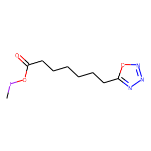

document.querySelector('title').textContent = 'ReLeaSE: Deep Reinforcement Learning for de-novo Drug Design ';
**ReLeaSE: Deep Reinforcement Learning for de-novo Drug Design** 


|  |
| --- |
| 
Quick Links
[Documentation](#doc)
[Notes](#notes)
[Interactive job](#int) 
[Batch job](#sbatch) 
[Swarm of jobs](#swarm) 
 |


ReLeaSE (Reinforcement Learning for Structural Evolution) is an application for de-novo Drug Design 
based on Reinforcement Learning. It integrates two deep neural networks: generative and
predictive, that are trained separately but are used jointly to generate novel targeted chemical libraries.
ReLeaSE uses simple representation of molecules by their simplified molecular input line entry specification (SMILES)
strings only.   
   

This application, reimplemented in Keras from the original version developed in PyTorch, 
is being used as a biological example by class #5 of the course
"Deep Learning by Example on Biowulf".


### References:


* Mariya Popova, Olexandr Isayev, Alexander Tropsha   

*Deep reinforcement learning for de novo drug design*  

[Scince Advances](https://advances.sciencemag.org/content/4/7/eaap7885?intcmp=trendmd-adv)  2018, **4**: eaap7885 (25 July 2018)


Documentation
* [ReLeaSE github page](https://github.com/isayev/ReLeaSE)


Important Notes
* Module Name: ReLeaSE (see [the modules page](https://hpc.nih.gov/apps/modules.html) for more information)
* Unusual environment variables set
	+ **RELEASE\_HOME**  installation directory
	+ **RELEASE\_BIN**       executable directory
	+ **RELEASE\_SRC**       source code directory
	+ **RELEASE\_DATA**  sample data and checkpoints directory


Interactive job
[Interactive jobs](/docs/userguide.html#int) should be used for debugging, graphics, or applications that cannot be run as batch jobs.
Allocate an [interactive session](/docs/userguide.html#int) and run the program. Sample session:


```

[user@biowulf]$ **sinteractive --mem=160g --gres=gpu:k80,lscratch:10 -c8**

```

or, in order to use 4 GPUs,

```

[user@biowulf]$ **sinteractive --mem=160g --gres=gpu:k80:4,lscratch:20 -c14**
[user@cn4204 ~]$**module load release** 
[+] Loading cuDNN/7.6.5/CUDA-10.0 libraries...
[+] Loading CUDA Toolkit  10.0.130  ...
[+] Loading release  20200516

```

The ReLeaSE application, as it is currently implemented on Biowulf, comprises the following source files:   


```

[user@cn4204]$ **ls $RELEASE\_SRC** 
data.py  options.py **predict.py** **visualize.py** stackAugmentedRNN.py
models.py  **train.py**  smiles.py utils.py

```

The executables are:

```

[user@cn4204]$ **ls $RELEASE\_BIN** 
predict.py  train.py  visualize.py

```

In particular, the command line options of the executable train.py are as follows: 

```

[user@cn4204]$ **train.py -h**
Using TensorFlow backend.
usage: train.py [-h] [-a ALPHA] [-b BATCH_SIZE] [-d DATA_TYPE] [-D]
                        [--dropout DROPOUT_FRACTION]
                        [--embedding_dim EMBEDDING_DIM] [--epochs NUM_EPOCHS]
                        [-f NUM_FOLDS] [-g num_gpus] [--delta DELTA]
                        [--hidden_size HIDDEN_SIZE] [-i input_checkpoint]
                        [--lr LR] -m TRAINING_MODE [--max_length MAX_LENGTH]
                        [--min_length MIN_LENGTH] [-n N_ROLLOUT]
                        [-N NUM_EPISODES] [-p PREDICT_LEN]
                        [-o output_checkpoint] [-O OPTIMIZER]
                        [-r RECURRENT_LAYER] [--stack_width STACK_WIDTH]
                        [--stack_depth STACK_DEPTH]
                        [--steps_per_epoch STEPS_PER_EPOCH] [-v]

optional arguments:
  -h, --help            show this help message and exit
  -a ALPHA, --alpha ALPHA
                        reinforcement learning rate; default = 0.001
  -b BATCH_SIZE, --batch_size BATCH_SIZE
                        input batch size; default=512
  -d DATA_TYPE, --data_type DATA_TYPE
                        Data type: jak2 | logp; default = jak2
  -D, --debug           output debugging info
  --dropout DROPOUT_FRACTION
                        the dropout fraction; default=0.2
  --embedding_dim EMBEDDING_DIM
                        the dimension of the embedding space; default=512
  --epochs NUM_EPOCHS, -e NUM_EPOCHS
                        number of iterations to train for; default = 51 for
                        jak2 and =25 for logp
  -f NUM_FOLDS, --num_folds NUM_FOLDS
                        number of folds in cross-validation split; default=5
  -g num_gpus, --num_gpus num_gpus
                        number of gpus to use; default=1
  --delta DELTA         discount rate; default = 0.98
  --hidden_size HIDDEN_SIZE
                        hidden_size; default = 256
  -i input_checkpoint, --input_checkpoint input_checkpoint
                        The name of the input checkpoint file; default = None
  --lr LR               learning rate (for generator) default: 3.e-4
  --max_length MAX_LENGTH
                        max length of a SMILES string to be used for training;
                        default=None
  --min_length MIN_LENGTH
                        min length of a SMILES string to be used for training;
                        default=None
  -n N_ROLLOUT, --n_rollout N_ROLLOUT
                        number of rollout trajectories to average over;
                        default=16
  -N NUM_EPISODES, --num_episodes NUM_EPISODES
                        number of episodesin the REINFORCE algorithm;
                        default=100
  -p PREDICT_LEN, --predict_len PREDICT_LEN
                        max length of a sequence used to predict next
                        character; default=120
  -o output_checkpoint, --output_checkpoint output_checkpoint
                        The name of the output checkpoint file; default=None
  -O OPTIMIZER, --optimizer OPTIMIZER
                        Optimizer to use for training: adadelta | adam |
                        rmsprop; default=adam
  -r RECURRENT_LAYER, --recurrent_layer RECURRENT_LAYER
                        Recurrent layer for generator: SimpleRNN | GRU | LSTM
                        | SA_SimpleRNN | SA_LSTM | SA_GRU (default)
  --stack_width STACK_WIDTH
                        stack_width; default = 1
  --stack_depth STACK_DEPTH
                        stack_depth; default = 100
  --steps_per_epoch STEPS_PER_EPOCH
                        stack_width; default = None
  -v, --verbose         increase the verbosity level of output

required arguments:
  -m TRAINING_MODE, --training_mode TRAINING_MODE
                        Training mode: generator | predictor | reinforce

```

To perform training of the predictor network using this executable, copy training data to the current folder:

```

[user@cn4204]$ **cp -r $RELEASE\_DATA/\* .**

```

ReLeaSE takes as input data in the SMILES (Simplified Molecular Input Line Entry Specification) format. For example, the data used for training Generator model look like:

```

[user@cn4204]$ **more data/chembl\_22\_clean\_1576904\_sorted\_std\_final.smi**
CCO     CHEMBL545
C       CHEMBL17564
CO      CHEMBL14688
NCCS    CHEMBL602
NCCN    CHEMBL816
CN      CHEMBL43280
C=O     CHEMBL1255
CCN     CHEMBL14449
...
CCC[N+](C)(C)CCO        CHEMBL105059
CCCCCCCCN1CCCCC1        CHEMBL105218
ClCC(=O)c1ccccc1        CHEMBL105712
CCCCCCCNc1ccccc1        CHEMBL106128
...
CCOc1ccc(CN2CCN(Cc3ccon3)CC2CCO)cc1     CHEMBL1890577
Fc1ccc(Cc2nnc(o2)C(=O)NCC2CCCO2)cc1     CHEMBL1889842
COc1ccc(CC(N)c2csc(Nc3ccccn3)n2)cc1     CHEMBL1884880
CN1CCN(CC1)NC(=O)c1cccc(c1)C(F)(F)F     CHEMBL1899891
O=C(NC1CCCCC1)C1CCCN1C(=O)Nc1ccccc1     CHEMBL1899656
CCc1nnc(NC(=O)CSc2nccn2Cc2ccccc2)s1     CHEMBL1901068
CCOC(=O)C(C)N1C=C(O)N(C1=O)c1ccccc1     CHEMBL1890667
...

```

A sample command to train Generator model on these data would be:

```

[user@cn4204]$ **train.py -m generator -r SA\_GRU -g 4 -b 1000 --lr 3.e-4** 
Using TensorFlow backend.
...
Model: "sequential_1"
_________________________________________________________________
Layer (type)                 Output Shape              Param #
=================================================================
embedding_1 (Embedding)      (None, 11, 512)           45568
_________________________________________________________________
stack_augmented_rnn_1 (Stack (None, 11, 256)           617216
_________________________________________________________________
dropout_1 (Dropout)          (None, 11, 256)           0
_________________________________________________________________
stack_augmented_rnn_2 (Stack (None, 11, 256)           420608
_________________________________________________________________
dropout_2 (Dropout)          (None, 11, 256)           0
_________________________________________________________________
stack_augmented_rnn_3 (Stack (None, 256)               420608
_________________________________________________________________
dropout_3 (Dropout)          (None, 256)               0
_________________________________________________________________
dense_1 (Dense)              (None, 89)                22873
=================================================================
Total params: 1,526,873
Trainable params: 1,526,873
Non-trainable params: 0
_________________________________________________________________
Model compiled with loss='categorical_crossentropy', lr= 0.0003

Training generator ...
...

```

or, using 4 GPUs,

```

[user@cn4204]$ **train.py -m generator -r SA\_GRU -g 4 -b 1000 --lr 3.e-4**
...

```

The data for training Predictor model look as follows:   

- for predicting JAK2 property value:

```

[user@cn4204]$ **more data/jak2\_data.csv**
SMILES,pIC50
O=S(=O)(Nc1cccc(-c2cnc3ccccc3n2)c1)c1cccs1,4.26
O=c1cc(-c2nc(-c3ccc(-c4cn(CCP(=O)(O)O)nn4)cc3)[nH]c2-c2ccc(F)cc2)cc[nH]1,4.34
NC(=O)c1ccc2c(c1)nc(C1CCC(O)CC1)n2CCCO,4.53
NCCCn1c(C2CCNCC2)nc2cc(C(N)=O)ccc21,4.56
CNC(=S)Nc1cccc(-c2cnc3ccccc3n2)c1,4.59
O=C(Nc1cccc(-c2cnc3ccccc3n2)c1)C1CC1,4.6
O=C(Nc1cccc(-c2cnc3ccccc3n2)c1)c1ccco1,4.61
COc1cc(Nc2nccc(-c3ccc(Cl)cc3)n2)cc(OC)c1OC,4.67
CN1C(=O)COc2c1cnc1ccc(Sc3nnc4c(F)cc(-c5cnn(C)c5)cn34)cc21,4.68
COc1ccc2c(c1)C(=O)N(c1nc(C(=O)Nc3cnccc3N3CCNCC3)cs1)C2,4.68
...

```

- for predicting logP property value:

```

[user@cn4204]$ **more data/logp\_labels.csv**
,SMILES,Kow
1,CC1CC2C3CCC4=CC(=O)C=CC4(C)C3(F)C(O)CC2(C)C1(O)C(=O)CO,1.885
2,CC(=O)OCC(=O)C1(O)CCC2C3CCC4=CC(=O)CCC4(C)C3C(O)CC21C,2.19
3,CC(=O)OCC(=O)C1(O)CCC2C3CCC4=CC(=O)CCC4(C)C3C(=O)CC21C,2.1
4,CCC1(c2ccccc2)C(=O)NC(=O)NC1=O,1.47
5,COC12C(COC(N)=O)C3=C(C(=O)C(C)=C(N)C3=O)N1CC1NC12,-0.4
6,CCC1(CC)C(=O)NC(=O)N(C)C1=O,1.15
7,CCC1(c2ccccc2)NC(=O)N(C)C1=O,1.69
8,O=P1(N(CCCl)CCCl)NCCCO1,0.63
9,CC(O)C(=O)O,-0.72
10,CC12CCC(=O)C=C1CCC1C2C(O)CC2(C)C(C(=O)CO)CCC12,1.94
11,CC12CCC(=O)C=C1CCC1C2C(O)CC2(C)C1CCC2(O)C(=O)CO,1.61
12,CC12C=CC(=O)C=C1CCC1C2C(O)CC2(C)C1CCC2(O)C(=O)CO,1.62
13,CC12CCC3c4ccc(O)cc4CCC3C1CC(O)C2O,2.45
14,CC12CCC3c4ccc(O)cc4CCC3C1CCC2O,4.01
15,Clc1ccc(C(c2ccc(Cl)cc2)C(Cl)(Cl)Cl)cc1,6.91
16,O=C(O)c1c(Cl)cccc1Cl,2.23
17,c1ccc2c(c1)cc1ccc3cccc4ccc2c1c34,6.13
18,CCCCC1C(=O)N(c2ccccc2)N(c2ccccc2)C1=O,3.16
...

```

Sample commands to train the Predictor model are:

```

[user@cn4204]$ **train.py -d jak2 -m predictor -g 1 -b 128 --lr 0.0001 -e 500**
...
Model: "sequential_1"
_________________________________________________________________
Layer (type)                 Output Shape              Param #
=================================================================
embedding_1 (Embedding)      (None, 120, 512)          45568
_________________________________________________________________
lstm_1 (LSTM)                (None, 128)               328192
_________________________________________________________________
dropout_1 (Dropout)          (None, 128)               0
_________________________________________________________________
batch_normalization_1 (Batch (None, 128)               512
_________________________________________________________________
dense_1 (Dense)              (None, 128)               16512
_________________________________________________________________
activation_1 (Activation)    (None, 128)               0
_________________________________________________________________
dense_2 (Dense)              (None, 1)                 129
_________________________________________________________________
activation_2 (Activation)    (None, 1)                 0
=================================================================
Total params: 390,913
Trainable params: 390,657
Non-trainable params: 256
_________________________________________________________________

Reading predictor data ...
...

[user@cn4204]$ **train.py -d logp -m predictor -g 1 -b 128 --lr 0.0001 -e 500** 
...

[user@cn4204]$ **train.py -m reinforce -d jak2** 
...

[user@cn4204]$ **train.py -m reinforce -d jak2 -i checkpoints/generator.weights.SA\_GRU.1.h5,checkpoints/predictor.weights.jak2.h5** 
...


```

After training the models, the checkpoints (model weights or the entire model) are save in the **checkpoints** folder.   
   

Executable **predict.py** takes as input a checkpoint file produced by Generator or Reinforce training to predict SMILES string, for example:

```

[user@cn4204]$ **predict.py -i checkpoints/generator.weights.SA\_GRU.1.h5** 
...
generated SMILES = C(NCCN2CCOCC2)=NC(=S)N(CCC)C            

[user@cn4204]$ **predict.py -i checkpoints/generator.weights.SA\_GRU.2.h5 --stack\_width 2**
...
Generated SMILES= 'CIOC(=O)CCCCCCc1nnno1'

[user@cn4204]$ **predict.py -r LSTM -i checkpoints/generator.weights.LSTM.h5** 
...
Generated SMILES= 'CC(O)=C(C(O)=O)N(C)C(=O)C(CCC(O)=O)NC(=O)COC(C)=O'

[user@cn4204]$ **predict.py -i checkpoints/reinforce.weights.jak2.SA\_GRU.1.h5,checkpoints/predictor.weights.jak2.h5** 
...
Generated SMILES= 'C[CH2]C=C(C)CCSSSCCCN=C=N'  jak2 property value= 0.4330919
...

[user@cn4204]$ **predict.py -s 'CC(Cl)=Cc3ccc(Cl)cc3' -i checkpoints/predictor.model.jak2.h5**
...
Input SMILES= 'CC(Cl)=Cc3ccc(Cl)cc3'  jak2 property value= 0.03461966


```

NOTE: since each the SMILES token is sampled randomly from the respective distribution, different runs of the same command may produce different SMILES strings.   
  

An executable visualize.py allows visualization of these SMILES strings:

```

[user@cn4204]$ **visualize.py -s "C(NCCN2CCOCC2)=NC(=S)N(CCC)C"**
```


```

[user@cn4204]$ **visualize.py -s "CIOC(=O)CCCCCCc1nnno1"**
```



```

[user@cn4204]$ **visualize.py -s "CC(O)=C(C(O)=O)N(C)C(=O)C(CCC(O)=O)NC(=O)COC(C)=O"**
```


  

End the interactive session:

```

[user@cn4204 ~]$ **exit**
salloc.exe: Relinquishing job allocation 46116226
[user@biowulf ~]$

```


