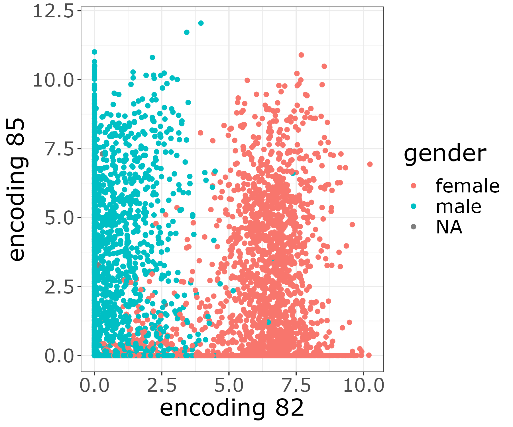
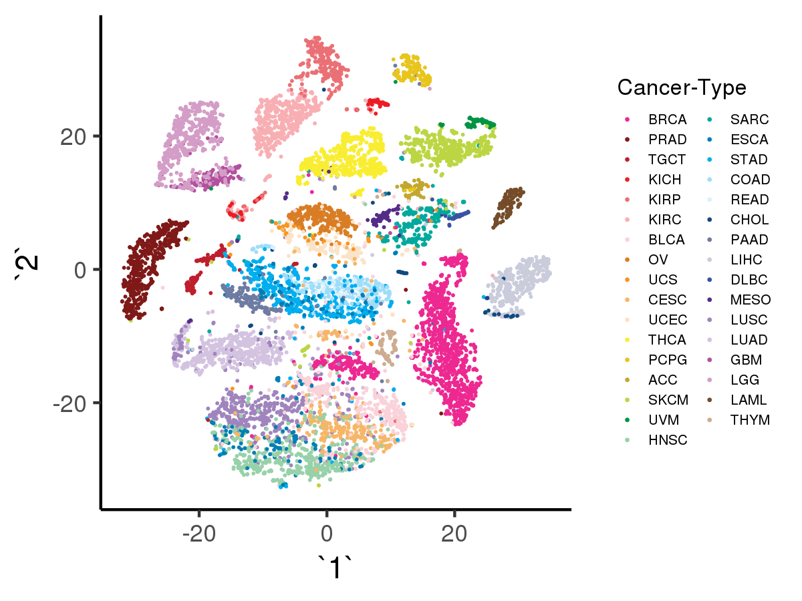

document.querySelector('title').textContent = 'Tybalt: extracting a biologically relevant latent space from cancer transcriptomes ';
**Tybalt: extracting a biologically relevant latent space from cancer transcriptomes** 


|  |
| --- |
| 
Quick Links
[Documentation](#doc)
[Notes](#notes)
[Interactive job](#int) 
[Batch job](#sbatch) 
[Swarm of jobs](#swarm) 
 |


Tybalt employs Keras deep learning framework to implement 
a variational autoencoder (VAE), capable of generating meaningful latent spaces
for image and text data. Tybalt has been trained 
on The Cancer Genome Atlas (TCGA) pan-cancer RNA-seq data 
and used to identify specific patterns in the VAE encoded features.   
   

This application is being used as a biological example in class #3 of the course
"Deep Learning by Example on Biowulf".


### References:


* Gregory P. Way, USACasey S. Greene   

*Extracting a biologically relevant latent space from cancer transcriptomes with variational autoencoders*  

[Pacific Simposium on Biocomputing](https://www.worldscientific.com/doi/abs/10.1142/9789813235533_0008)  2014, **23:** 80–91


Documentation
* [Tybalt github page](https://github.com/greenelab/tybalt)


Important Notes
* Module Name: Tybalt (see [the modules page](https://hpc.nih.gov/apps/modules.html) for more information)
* Unusual environment variables set
	+ **TYBALT\_HOME**  installation directory
	+ **TYBALT\_SRC**       source code directory
	+ **TYBALT\_DATA**  sample data directory


Interactive job
[Interactive jobs](/docs/userguide.html#int) should be used for debugging, graphics, or applications that cannot be run as batch jobs.
Allocate an [interactive session](/docs/userguide.html#int) and run the program. Sample session:


```

[user@biowulf]$ **sinteractive --mem=36g --gres=gpu:v100,lscratch:10**
[user@cn3200 ~]$**module load Tybalt** 
[+] Loading libarchive  3.3.2 
[+] Loading singularity  on cn4470 
[+] Loading python 3.6  ... 
[+] Loading cuDNN 7.0  libraries... 
[+] Loading CUDA Toolkit  9.0.176  ... 
[+] Loading gcc  7.2.0  ... 
[+] Loading GSL 2.4 for GCC 7.2.0 ... 
[+] Loading openmpi 3.0.0  for GCC 7.2.0 
[+] Loading R 3.5.0_build2 
[+] Loading Tybalt 0.1.3  ... 

```

The Tybalt code implemented in Biowulf currently includes the folloeing executables:   

- shell script **download\_data.sh** downloads raw data, including the Glioblastoma NF1 data, UCSC Xena Data Browser Copy Number data and Clinical data files from JHU;  

- python script **preprocess\_data.py** performs pre-processing of the raw data;  

- python script **train.py** performs training of either variational autoencoder (VAE) or denoising autoencoder (ADAGE) on the pre-processed data,   
 
- python script **predict.py** that computes the latent features by encoding the input data and then computes the tSNE (t-distributed Stochastic Neighbor Embedding) features required for plotting the results, and   
 
- R script **visualize.R** performs visualization of the resulting clusters.   
   

To see the entire list of source files and copy it to your current folder, type:

```

[user@cn3200]$ **ls $TYBALT\_SRC** 
download_data.sh  options.py             preprocess_data.py    predict.py 
models.py         parse_hpo_results.py   train.py              visualize.R
[user@cn3200]$ **cp -r $TYBALT\_SRC/\* .** 

```

To download (raw) data, run the command

```

[user@cn3200]$ **download\_data.sh**

```

that will create a subfolder tree **data/raw** in the current folder: 

```

[user@cn3200]$ **tree data**
data
└── raw
    ├── Gistic2_CopyNumber_Gistic2_all_thresholded.by_genes
    ├── HiSeqV2
    ├── PANCAN_clinicalMatrix
    ├── PANCAN_mutation
    └── samples.tsv

```

The data pre-processing command:

```

[user@cn3200]$  **preprocess\_data.py**

```
 
will produce a number of other files in the subfolder **data**:

```

[user@cn3200]$ **tree data** 
data
├── clinical_data.tsv
├── copy_number_gain.tsv.gz
├── copy_number_loss.tsv.gz
├── oncokb_genetypes.tsv
├── pancan_mutation_burden.tsv
├── pancan_mutation.tsv.gz
├── pancan_scaled_rnaseq.tsv.gz
├── pancan_scaled_zeroone_rnaseq.tsv.gz
├── raw
│   ├── Gistic2_CopyNumber_Gistic2_all_thresholded.by_genes
│   ├── HiSeqV2
│   ├── PANCAN_clinicalMatrix
│   ├── PANCAN_mutation
│   └── samples.tsv
└── status_matrix.tsv.gz

```

Since this command will take a while to complete, alternatively you can download the
already pre-processed data from a system foder:

```

[user@cn3200]$ **cp -r $TYBALT\_DATA/\* .** 

```

To train an autoencoder on the pre-processed data, use the script **train.py**:

```

[user@cn3200]$ **train.py -h** 
...
usage: train.py [-h] [-d depth] [-e num_epochs] [-E executions_per_trial]
                [-F hyperband_factor] [--hidden_dim hidden_dim]
                [-I hyperband_iterations] [-k kappa] [-l learning_rate]
                [-m model_name] [-N noise] [-o optimizer] [-p prefix]
                [-s sparsity] [-T num_trials] [-v] [--val_split val_split]
                [-W wall_time] [-z latent_dim] [-b batch_size]
                [-f output_filename] [--hpo hpo_method]

optional arguments:
  -h, --help            show this help message and exit
  -d depth, --depth depth
                        Number of layers between input and latent layer;
                        default=1
  -e num_epochs, --num_epochs num_epochs
                        # of epochsl default=100
  -E executions_per_trial, --executions_per_trial executions_per_trial
                        # of executions per HPO trial; default=3
  -F hyperband_factor, --hb_factor hyperband_factor
                        division factor used by the hyperband HPO algorithm;
                        default=2
  --hidden_dim hidden_dim
                        Dimensionality of the first hidden layer
  -I hyperband_iterations, --hb_iters hyperband_iterations
                        # of hyperband iterations; default=100
  -k kappa, --kappa kappa
                        How fast to linearly ramp up KL loss
  -l learning_rate, --lr learning_rate
                        learning rate; default=1.e-5
  -N noise, --noise noise
                        How much Gaussian noise to add during training
  -o optimizer, --optimizer optimizer
                        optimizer: adam | rmsprop
  -p prefix, --checkpoint_prefix prefix
                        prefix of the output checkpoint file
                        ..h5
 -s sparsity, --sparsity sparsity
 How much L1 regularization penalty to apply
 -T num\_trials, --max\_trials num\_trials
 max # of trials in hp optimization; default=50
 -v, --verbose increase the verbosity level of output
 --val\_split val\_split
 increase the verbosity level of output
 -W wall\_time, --wall\_time wall\_time
 Wall time for HPO with CANDLE; default="24:00:00"
 -z latent\_dim, --latent\_dim latent\_dim
 Dimensionality of the latent space
 -b batch\_size, --bs batch\_size
 batch size; default=50
 -f output\_filename, --output\_filename output\_filename
 The name of the file to store results
 --hpo hpo\_method hpo method: random | bayesian | hyperband,
 default=None

required arguments:
 -m model\_name, --model\_name model\_name
 model name: vae | adage

```

The script will use as input a pre-defined file from the folder **data**. It requires specification of the network model to be used: 'vae' for the variational autoencoder and 'adage' for denoising autoencoder.   
  


Here are examples of the training command:

```

[user@cn3200]$ **train.py -m vae** 
...
Train on 9413 samples, validate on 1046 samples
Epoch 1/50
9413/9413 [==============================] - 3s 322us/step - loss: 2918.8174 - val_loss: 2815.0830
Epoch 2/50
9413/9413 [==============================] - 2s 202us/step - loss: 2786.0095 - val_loss: 2780.5930
...
[user@cn3200]$ **train.py -m adage** 
...

```

Hyperparameter optimization is performed by train.py with --hpo option. The code supports optimization of any of the following six hyperparameters:   

- depth   

- hidden\_dim   

- kappa   

- batch\_size   

- num\_epochs   
 
- learning\_rate   

User can to specify the proposed ranges of variation of one or more of these hyperparameters through command line options, as comma-separated strings, without spaces.For example:

```

[user@cn3200]$ **./train.py -m vae --hpo random -d 1,2 --hidden\_dim=100,300 -k 0.1,1. -b 50,100,200 -e 50,100 -l 0.0005,0.001** 

```

If ranges of variation are specified for only a subset of these hyperparameters, then for the rest of the hyperparameters their default values will be used. This command will produce a folder of results named  **ktuner\_vae\_random.** To extract the results sorted by objective score, run the command:

```

[user@cn3200]$ **parse\_hpo\_results.py ktuner\_vae\_random**
score= 0.879 depth= 1 hidden_dim=300 kappa=0.100 batch_size=200 num_epochs=  50 learning_rate=0.0025
score= 0.879 depth= 2 hidden_dim=300 kappa=1.000 batch_size=200 num_epochs=  10 learning_rate=0.001
score=  0.88 depth= 2 hidden_dim=300 kappa=0.100 batch_size=100 num_epochs=  50 learning_rate=0.0005
score=  0.88 depth= 2 hidden_dim=100 kappa=1.000 batch_size=200 num_epochs= 100 learning_rate=0.0025
score=  0.88 depth= 1 hidden_dim=300 kappa=0.100 batch_size=200 num_epochs=  10 learning_rate=0.001
score= 0.882 depth= 1 hidden_dim=100 kappa=0.010 batch_size= 50 num_epochs=  25 learning_rate=0.0025
score= 0.882 depth= 1 hidden_dim=300 kappa=0.010 batch_size= 50 num_epochs=  10 learning_rate=0.002
score= 0.882 depth= 1 hidden_dim=100 kappa=0.050 batch_size= 50 num_epochs=  10 learning_rate=0.001
...

```

In a similar way, hyperparameter optimization can be peforrmed with other types of tuners or with alternative "adage" model. For example:

```

[user@cn3200]$ **train.py -m vae --hpo hyperband -d 2,3,4,5,6,7,8,9,10 --hidden\_dim 300,500,700,1000,3000** 
...
[user@cn3200]$ **./parse\_hpo\_results.py ktuner\_vae\_hyperband**
score= 0.882 depth= 3 hidden_dim=1000 kappa=1.000 batch_size= 50 num_epochs= 100 learning_rate=0.0005
score= 0.882 depth= 2 hidden_dim=1000 kappa=1.000 batch_size= 50 num_epochs= 100 learning_rate=0.0005
score= 0.882 depth= 3 hidden_dim=500 kappa=1.000 batch_size= 50 num_epochs= 100 learning_rate=0.0005
score= 0.883 depth= 3 hidden_dim=700 kappa=1.000 batch_size= 50 num_epochs= 100 learning_rate=0.0005
score= 0.883 depth= 2 hidden_dim=500 kappa=1.000 batch_size= 50 num_epochs= 100 learning_rate=0.0005
score= 0.883 depth= 2 hidden_dim=300 kappa=1.000 batch_size= 50 num_epochs= 100 learning_rate=0.0005
score= 0.883 depth= 3 hidden_dim=300 kappa=1.000 batch_size= 50 num_epochs= 100 learning_rate=0.0005
score= 0.885 depth= 2 hidden_dim=700 kappa=1.000 batch_size= 50 num_epochs= 100 learning_rate=0.0005
score= 0.889 depth= 4 hidden_dim=500 kappa=1.000 batch_size= 50 num_epochs= 100 learning_rate=0.0005
score= 0.891 depth= 8 hidden_dim=300 kappa=1.000 batch_size= 50 num_epochs= 100 learning_rate=0.0005
score= 0.894 depth= 6 hidden_dim=700 kappa=1.000 batch_size= 50 num_epochs= 100 learning_rate=0.0005
score= 0.894 depth= 7 hidden_dim=300 kappa=1.000 batch_size= 50 num_epochs= 100 learning_rate=0.0005
score= 0.894 depth= 9 hidden_dim=500 kappa=1.000 batch_size= 50 num_epochs= 100 learning_rate=0.0005
score= 0.894 depth= 7 hidden_dim=500 kappa=1.000 batch_size= 50 num_epochs= 100 learning_rate=0.0005
score= 0.894 depth= 5 hidden_dim=500 kappa=1.000 batch_size= 50 num_epochs= 100 learning_rate=0.0005
score= 0.894 depth= 5 hidden_dim=700 kappa=1.000 batch_size= 50 num_epochs= 100 learning_rate=0.0005
score= 0.894 depth= 8 hidden_dim=700 kappa=1.000 batch_size= 50 num_epochs= 100 learning_rate=0.0005
score= 0.894 depth= 6 hidden_dim=300 kappa=1.000 batch_size= 50 num_epochs= 100 learning_rate=0.0005
score= 0.896 depth= 5 hidden_dim=300 kappa=1.000 batch_size= 50 num_epochs= 100 learning_rate=0.0005
score= 0.917 depth= 6 hidden_dim=500 kappa=1.000 batch_size= 50 num_epochs= 100 learning_rate=0.0005
score=  1.02 depth=10 hidden_dim=3000 kappa=1.000 batch_size= 50 num_epochs= 100 learning_rate=0.0005
...
[user@cn3200]$ **./train.py -m adage --hpo bayesian -d 2,3,4 --hidden\_dim 500,700,1000 -b 50,100**  
...  
[user@cn3200]$ **parse\_hpo\_results.py ktuner\_adage\_bayesian** 
score=  2.77 depth= 2 hidden_dim=500 kappa=1.000 batch_size= 50 num_epochs= 100 learning_rate=0.0005
score=   2.8 depth= 2 hidden_dim=500 kappa=1.000 batch_size= 50 num_epochs= 100 learning_rate=0.0005
score=  2.86 depth= 2 hidden_dim=500 kappa=1.000 batch_size= 50 num_epochs= 100 learning_rate=0.0005
score=  2.89 depth= 2 hidden_dim=500 kappa=1.000 batch_size= 50 num_epochs= 100 learning_rate=0.0005
score=  2.89 depth= 2 hidden_dim=500 kappa=1.000 batch_size= 50 num_epochs= 100 learning_rate=0.0005
score=   2.9 depth= 2 hidden_dim=500 kappa=1.000 batch_size= 50 num_epochs= 100 learning_rate=0.0005
score=  2.98 depth= 2 hidden_dim=500 kappa=1.000 batch_size= 50 num_epochs= 100 learning_rate=0.0005
score=  3.02 depth= 2 hidden_dim=500 kappa=1.000 batch_size= 50 num_epochs= 100 learning_rate=0.0005
score=  3.02 depth= 2 hidden_dim=500 kappa=1.000 batch_size= 50 num_epochs= 100 learning_rate=0.0005
score=  3.03 depth= 2 hidden_dim=500 kappa=1.000 batch_size= 50 num_epochs= 100 learning_rate=0.0005
score=  3.06 depth= 2 hidden_dim=500 kappa=1.000 batch_size= 50 num_epochs= 100 learning_rate=0.0005
score=  3.15 depth= 2 hidden_dim=500 kappa=1.000 batch_size= 50 num_epochs= 100 learning_rate=0.0005
score=  3.17 depth= 2 hidden_dim=500 kappa=1.000 batch_size= 50 num_epochs= 100 learning_rate=0.0005
score=  3.22 depth= 2 hidden_dim=500 kappa=1.000 batch_size= 50 num_epochs= 100 learning_rate=0.0005
score=  3.24 depth= 2 hidden_dim=500 kappa=1.000 batch_size= 50 num_epochs= 100 learning_rate=0.0005
score=  3.24 depth= 2 hidden_dim=500 kappa=1.000 batch_size= 50 num_epochs= 100 learning_rate=0.0005
score=  3.26 depth= 2 hidden_dim=500 kappa=1.000 batch_size= 50 num_epochs= 100 learning_rate=0.0005
score=  3.27 depth= 2 hidden_dim=500 kappa=1.000 batch_size= 50 num_epochs= 100 learning_rate=0.0005
score=   3.3 depth= 2 hidden_dim=500 kappa=1.000 batch_size= 50 num_epochs= 100 learning_rate=0.0005
...
...

```

Prediction of the latent variables is performed by **predict.py**:

```

[user@cn3200]$ **predict.py -h**
Using TensorFlow backend.
usage: predict.py [-h] [-c FIRST_LAYER] [-d DEPTH] [-m model_name]
                  [-N NOISE] [-o test_results] [-p in_prefix]
                  [-s SPARSITY]

optional arguments:
  -h, --help            show this help message and exit
  -c FIRST_LAYER, --first_layer FIRST_LAYER
                        Dimensionality of the first hidden layer
  -d DEPTH, --depth DEPTH
                        Number of layers between input and latent layer;
                        default=1
  -N NOISE, --noise NOISE
                        How much Gaussian noise to add during training
  -o test_results, --output test_results
                        output file with test results;
                        default='test_results.h5'
  -p in_prefix, --checkpoint_prefix in_prefix
                        prefix of the input checkpoint file
                        ..h5

required arguments:
 -m model\_name, --model\_name model\_name
 model name: vae | adage
[user@cn3200]$ **predict.py -m vae**
...
[user@cn3200]$ **predict.py -m adage**
...
[user@cn3200]$ **predict.py -m rnaseq**
...

```

The latter command will use as input the preprocessed RNAseq data (of dimention 5000), rather than the data
from the latent space, encoded by either VAE or ADAGE encoder (of dimension 100).
  

Before running the executable visualize.R,   

1)  Make sure you set up a
[graphical X11 connection](https://hpc.nih.gov/docs/connect.html). 
Both NX and MobaXterm work well for Windows users, while XQuartz works well for Mac users.


2) Make sure you performed the data downloading, preprocessing, training and prediction steps 
described above. These steps produce the input data for visualizations. 
Alternatively, you can simply download the already processed data:

```

[user@cn3200]$ **cp -r $TYBALT\_DATA/\* .**

```

3) load R module and create an output folder **figures**:

```

[user@cn3200]$ **module load R/4.0.0** 
[user@cn3200]$ **mkdir -p figures** 

```


Now you should be able to run the script **visualize.R** 
with appropriate command line option.   

For example, the following command visualizes a plot indicating that encoding 82 stratifies patient sex:

```

[user@cn3200]$ **visualize.R -g**

```



img {
 display: block;
 margin-left: auto;
 margin-right: auto;
}

The resulting image file will be stored in the output folder **figures**.   

Next command produces a plot indicating that encodings 53 and 66 together separate melanoma tumors.

```

[user@cn3200]$ **visualize.R -t**

```


  

With option -v, the script will visualize the results of tSNE applied to the data encoded by VAE, i.e. the input data shape is (10459, 100):

```

[user@cn3200]$ **visualize.R -v**

```


  

The following command will visualize similar results produced by tSNE applied to the original, unencoded RNAseq data, with shape (10459, 5000):

```

[user@cn3200]$ **visualize.R -r**

```


Likewise, with option -a the script will visualize the tSNE results using as input the data encoded by denoising autoencoder with **adage** model, with input data shape = (10459, 100)): 

```

[user@cn3200]$ **visualize.R -a**

```


  


End the interactive session:

```

[user@cn3200 ~]$ **exit**
salloc.exe: Relinquishing job allocation 46116226
[user@biowulf ~]$

```


