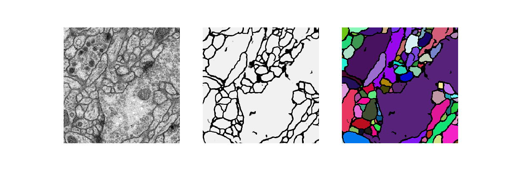

document.querySelector('title').textContent = 'UNet: a convolutional network for biomedical image segmentation ';
**UNet: a convolutional network for biomedical image segmentation** 


|  |
| --- |
| 
Quick Links
[Documentation](#doc)
[Notes](#notes)
[Interactive job](#int) 
[Batch job](#sbatch) 
[Swarm of jobs](#swarm) 
 |


UNet is a winner of the ISBI bioimage segmentation challenge 2015.
It relies on data augmentation to use the available annotated samples more efficiently. 
The architecture consists of a contracting path to capture context 
and a symmetric expanding path that enables precise localization.   
   

This application is being used as a biological example in class #1 of the course "Deep Learning by Example on Biowulf".


### References:


* Olaf Ronneberger, Philipp Fischer, Thomas Brox   

 *U-Net: Convolutional Networks for Biomedical Image Segmentation*   

[arXiv:1505.04597](https://arxiv.org/abs/1505.04597)  18 May, 2015   
* U-Net implementationi in Keras: <https://github.com/zhixuhao/unet>* Vincent Casser, Kai Kang, Hanspeter Pfister and Daniel Haehn   

 *Fast Mitochondria Segmentation for Connectomics*  

[arXiv:1812.06024](https://arxiv.org/abs/1812.06024)


Important Notes
* Module Name: UNet (see [the modules page](https://hpc.nih.gov/apps/modules.html) for more information)
* Unusual environment variables set
	+ **UNET\_HOME**  UNet installation directory
	+ **UNET\_BIN**       UNet executable directory
	+ **UNET\_SRC**     a folder containing the source code
	+ **UNET\_DATA**    a folder containing sample data


Interactive job
[Interactive jobs](/docs/userguide.html#int) should be used for debugging, graphics, or applications that cannot be run as batch jobs.
Allocate an [interactive session](/docs/userguide.html#int) and run the program. Sample session:


```

[user@biowulf]$ **sinteractive --mem=16g --gres=gpu:v100:1,lscratch:10 -c4** 
[user@cn4471 ~]$**module load unet** 
[+] Loading cuDNN/8.0.3/CUDA-11.0 libraries...
[+] Loading CUDA Toolkit  11.0.3  ...
[+] Loading gcc 4.8.5  ...
[+] Loading Qt 5.9.4  ...
[+] Loading UNet 20210223  ...

```

The bin directory of the application includes three executable files: 
train.py, predict.py and visualize.py. 
In order to display the usage message and available command line options for an executable, 
type its name followed by the option "-h". For example:

```

[user@cn4471 ~]$ **train.py -h** 
...
usage: train.py [-h] -d data_folder [-a augmentation_rate] [-b batch_size] [--beta tversky_beta] [-c object_class]
                [--cw class_weights] [--drop_rate drop_rate] [-e num_epochs] [-F start_filters] [-g num_gpus]
                [--gamma tversky_gamma] [-l learning_rate] [--loss loss_type] [-n] [-s] [--save_augmented] [-v]
                [-w] [-X X] [-Y Y]

optional arguments:
  -h, --help            show this help message and exit
  -a augmentation_rate, --augmentation_rate augmentation_rate
                        by how many folds to increase the effective data size; default=20
  -b batch_size, --bs batch_size
                        batch size; default=2
  --beta tversky_beta   class balancing weight in the Trersky index: TI = TP/(TP + beta*FP + (1-beta)*FN)
  -c object_class, --object_class object_class
                        Detected object class(es): memb | mito | multi; default = membr
  --cw class_weights    Comma-separated class weights
  --drop_rate drop_rate
                        drop rate; default=0.5
  -e num_epochs, --num_epochs num_epochs
                        number of epochs; default=160
  -F start_filters, --start_filters start_filters
                        num. filters used in the 1st convolution of the network model; default=64 if
                        object_class=membr; =8 if object_class=mito; and =48 if object_class=multi
  -g num_gpus, --num_gpus num_gpus
                        number of gpus to use; default=1
  --gamma tversky_gamma
                        a power in the Trersky focal loss
  -l learning_rate, --lr learning_rate
                        learning rate; default=1.e-4
  --loss loss_type      loss type: bce | cce | wcce | dice | jaccard | tversky; default: wcce if object_class ==
                        'multi' and bce otherwise
  -n, --no_augmentation
                        don't perform data augmentation, i.e. use original input data; default=False
  -s, --summary         print the model summary
  --save_augmented      save augmented data (in the subfolder 'augmented'
  -v, --verbose         increase the verbosity level of output
  -w, --load_weights    read weights from a checkpoint file
  -X X, --image_width X
                        image width; should be multiple of 16; default=256
  -Y Y, --image_height Y
                        image height; should be multiple of 16; default=256

required arguments:
  -d data_folder, --data_folder data_folder
                        data folder name, e.g. 'data_isbi' or 'data_hhmi'

```

In order to run the training executable on available sample data, first compy the data to your current folder:

```

[user@cn4471 ~]$ **cp -r $UNET\_DATA/\* .**

```

There are currently two sample datasets available, 
both comprising 2D EM images of Drosophila brain slices. 
The first dataset includes 30 pre-processed grayscale images 
together with corresponding binary masks for neural membranes
from the [ISBI Challenge](http://brainiac2.mit.edu/isbi_challenge/). 
It comes together with the Keras [UNet implementation](https://github.com/zhixuhao/unet) code available at GitHub. This dataset is stored in the folder "data\_isbi".   
   

The second dataset, stored in the folder data\_hhmi, includes 24 pre-processed grayscale images 
together with the corresponrding binary masks for both the neural membranes and mitochondria.
This more challenging dataset was generated as a part of the 
[Fly Brain Connectome project](https://www.sciencedirect.com/science/article/pii/S0092867418307876) 
conducted at the Howard Hughes Medical Institute.   
   

Here is the command to train the UNet on the augmented data from the 1st dataset under default options:

```

[user@cn4471 ~]$ **train.py -d data\_isbi**
Using Tensorflow backend.
...
Epoch 1/100
300/300 [==============================] - 28s 92ms/step - loss: 0.6890 - acc: 0.7793
Epoch 2/100
300/300 [==============================] - 21s 71ms/step - loss: 0.6809 - acc: 0.7817
Epoch 3/100
300/300 [==============================] - 21s 71ms/step - loss: 0.6731 - acc: 0.7815
Epoch 4/100
...
Epoch 99/100
300/300 [==============================] - 21s 71ms/step - loss: 0.0979 - acc: 0.9765
Epoch 100/100
300/300 [==============================] - 21s 71ms/step - loss: 0.0965 - acc: 0.9766

```

The trainig results, i.e. model weights, will be stored in the checkpoint file stored in the folder "checkpoints", in the HDF5 format,

```

**checkpoints/&ltmodel\_name&gt.&ltdata\_folder\_name&gt.&ltobject\_class&gt.h5**

```

in this particular case - in the file:

```

**checkpoints/unet.data\_isbi.membr.h5**. 

```

The prefix of the output checkpoint file can be changed through a command line option of the train.py. 
  
   

We can now use this file to predict membrane masks using as input 30 unaugmented grayscale images:

```

[user@cn4471 ~]$ **predict.py -d data\_isbi**
Using TensorFlow backend.
...
30/30 [==============================] - 2s 81ms/step
...

```

For each the grayscale image file i.png (i=0,1,...,29), this command will produce a binary mask 
i\_predict.png together with an RGB image i\_predict\_RGB.png with colored the connected components 
of the binary image.   
   

The predictions will be stored in the folder data\_isbi/membrane/test.  
   

In order to visualize these results, use the visualize.py application:

```

[user@cn4471 ~]$ **visualize.py -h** 
usage: visualize.py [-h] [-c object_class] [-d data_folder] [-i image_path] [-n image_id]

optional arguments:
  -h, --help            show this help message and exit
  -c object_class, --object_class object_class
                        Detected object class(es): membr | mito | multi; default = membr
  -d data_folder, --data_folder data_folder
                        path to the top data folder
  -i image_path, --image image_path
                        a path to the image to be visualized
  -n image_id, --image_id image_id
                        a number in the range(num_images)

```

Here, either the option -i or -n is required. For example, to visualize the 0-th data item, type: 

```

[user@cn4471 ~]$ **visualize.py -n 0 -d data\_isbi** 

```


  

In order to use the second dataset, one can run similar train.py and predict.py commands, but with option "-d data\_hhmi":

```

[user@cn4471 ~]$ **train.py -d data\_hhmi** 
Using TensorFlow backend.
...
Epoch 1/100
300/300 [==============================] - 31s 104ms/step - loss: 0.1928 - acc: 0.9111
Epoch 2/100
300/300 [==============================] - 22s 72ms/step - loss: 0.1388 - acc: 0.9335
Epoch 3/100
300/300 [==============================] - 21s 71ms/step - loss: 0.1269 - acc: 0.9395
...
Epoch 159/160
240/240 [==============================] - 17s 72ms/step - loss: 0.0351 - acc: 0.9856
Epoch 160/160
240/240 [==============================] - 17s 72ms/step - loss: 0.0349 - acc: 0.9856

```

This command will produce a checkpoint file hhmi.membrane.h5 in folder "checkpoints".   

Alternatively, a folder with already pre-computed checkpoint files can be copied from $UNET\_DATA:

```

[user@cn4471 ~]$ **cp -r $UNET\_DATA/checkpoints .** 

```

Now we can run the executable predict.py:

```

[user@cn4471 ~]$ **predict.py -d data\_hhmi** 
Using TensorFlow backend
...
24/24 [==============================] - 2s 98ms/step
...
[user@cn4471 ~]$ **visualize.py -n 1 -d data\_hhmi**

```


  

Likewise, training the unet model on the HHMI mitochondria data can be performed,
with subsequent prediction and visualization of the binary segmentation of mitochondria:

```

[user@cn4471 ~]$ **train.py -d data\_hhmi -c mito** 
...
[user@cn4471 ~]$ **predict.py -d data\_hhmi -c mito** 
...
[user@cn4471 ~]$ **visualize.py -n 1 -d data\_hhmi -c mito**

```


  

  

Using additional command line options, one can also   

- store checkpoints for each epochs, rather than for the last epoch only;   

- output a summary of the network model;   

- change the data type for the 2nd dataset from "membrane" (default) to "mito" (=mitochondria); as well as  

- vary other hyper-parameters, such as the number of training epochs, the batch size, the number of images 
produced during augmentation of the training data, etc.   
   

In order to train the UNet using **multiple GPUs**,   

- allocate a session with appropriate number of GPUs (you are allowed to use up to 4 GPUs per session),   

- specify through a command line option -g how many GPUs you want to use, and   

- specify a batch size that is multiple of the number of GPUs you will be using.   

For example:

```

[user@cn4471 ~]$ **exit**
[user@biowulf ~] **sinteractive --mem=16g --gres=gpu:v100:4,lscratch:40 -c14** 
[user@cn4471 ~]$ **module load unet** 
[user@cn4471 ~]$ **cp -r $UNET\_DATA/\* .**
[user@cn4471 ~]$ **train.py -d data\_isbi -g 4 -b 8** 
Using TensorFlow backend.
...
 StreamExecutor with strength 1 edge matrix:
2019-04-23 07:38:17.419226: I tensorflow/core/common_runtime/gpu/gpu_device.cc:988]      0 1 2 3 
2019-04-23 07:38:17.419241: I tensorflow/core/common_runtime/gpu/gpu_device.cc:1001] 0:   N Y N N 
2019-04-23 07:38:17.419252: I tensorflow/core/common_runtime/gpu/gpu_device.cc:1001] 1:   Y N N N 
2019-04-23 07:38:17.419262: I tensorflow/core/common_runtime/gpu/gpu_device.cc:1001] 2:   N N N Y 
2019-04-23 07:38:17.419271: I tensorflow/core/common_runtime/gpu/gpu_device.cc:1001] 3:   N N Y N
...
Epoch 1/160
18/18 [==============================] - 28s 2s/step - loss: 0.6806 - acc: 0.7497
Epoch 2/160
18/18 [==============================] - 11s 588ms/step - loss: 0.5285 - acc: 0.7811
Epoch 3/160
18/18 [==============================] - 11s 590ms/step - loss: 0.4687 - acc: 0.7814
...

```

End the interactive session:

```

[user@cn4471 ~]$ **exit**
salloc.exe: Relinquishing job allocation 46116226
[user@biowulf ~]$

```

Batch job
Most jobs should be run as [batch jobs](/docs/userguide.html#submit).
Create a batch input file (e.g. unet.sh). For example:


```

#!/bin/bash
module load unet 
cp -r $UNET_DATA/* .
train.py  -e 100 -l 0.0001

```

Submit this job using the Slurm [sbatch](/docs/userguide.html) command.


```
sbatch [--cpus-per-task=#] [--mem=#] unet.sh
```


