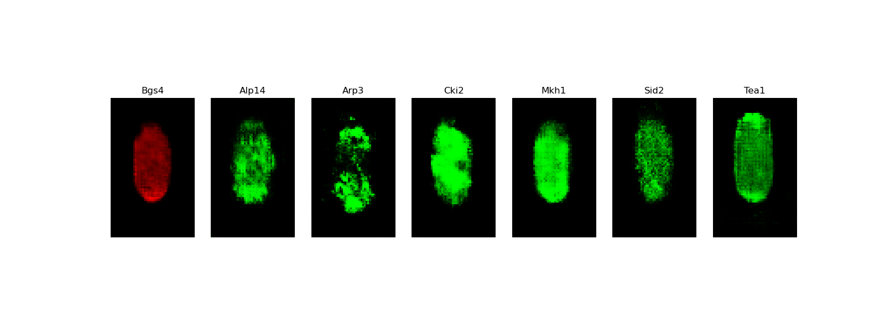

document.querySelector('title').textContent = 'BioGANs: GANs for Biological Image Synthesis ';
**BioGANs: GANs for Biological Image Synthesis** 


|  |
| --- |
| 
Quick Links
[Documentation](#doc)
[Notes](#notes)
[Interactive job](#int) 
[Batch job](#sbatch) 
[Swarm of jobs](#swarm) 
 |


BioGANs is a novel application of Generative Adversarial Networks (GANs) to the synthesis of 
fluorescence microscopy images of living cells. It allows to infer and visualize the correlated 
localization patterns of different fluorescent proteins. These patterns reflect important biological 
functions, but cannot be visualized experimentally for multiple proteins at the 
same stage of cell growth cycle.   
   

This application, reimplemented in Keras from the original version devreloped in PyTorch,
 is being used as a biological example in class #4 of the course
"Deep Learning by Example on Biowulf".


### References:


* Anton Osokin, Anatole Chessel, Rafael E. Carazo Salas and Federico Vaggi   

*GANs for Biological Image Synthesis*  

[ICCV 2017](http://openaccess.thecvf.com/content_iccv_2017/html/Osokin_GANs_for_Biological_ICCV_2017_paper.html)  p.2233–2242   
* James Dodgson, Anatole Chessel, Federico Vaggi, Marco Giordan, Miki Yamamoto, Kunio Arai, 
 Marisa Madrid, Marco Geymonat, Juan Francisco Abenza, José Cansado, Masamitsu Sato, 
 Attila Csikasz-Nagy, Rafael Edgardo Carazo Salas  

*Reconstructing regulatory pathways by systematically mapping
protein localization interdependency networks*  

[bioRxiv](https://www.biorxiv.org/content/10.1101/116749v1.full) doi: https://doi.org/10.1101/116749.


Documentation
* [BioGANs github page](https://github.com/aosokin/biogans)


Important Notes
* Module Name: BioGANs (see [the modules page](https://hpc.nih.gov/apps/modules.html) for more information)
* Unusual environment variables set
	+ **BG\_HOME**  installation directory
	+ **BG\_BIN**       executable directory
	+ **BG\_SRC**       source code directory
	+ **BG\_DATA**  sample data and checkpoints directory


Interactive job
[Interactive jobs](/docs/userguide.html#int) should be used for debugging, graphics, or applications that cannot be run as batch jobs.
Allocate an [interactive session](/docs/userguide.html#int) and run the program. Sample session:


```

[user@biowulf]$ **sinteractive --mem=40g --gres=gpu:p100,lscratch:10 -c8**
[user@cn3200 ~]$**module load biogans** 
[+] Loading singularity  3.8.4  on cn4225
[+] Loading biogans  20220825

```

The BioGANs application, as it is implemented on Biowulf, comprises the following three executables: 
**train.py**, **predict.py** and **visualize.py**.   
  

**train.py** takes as input two-channel fluorescence microscopy images from the Localization Interdeoendency Network (LIN) dataset   

  and performs training of any one of the three available neural network architrectures,   

    (1) DCGAN,   

    (2) DCGAN-separable, or   
 
    (3) DCGAN-starshaped (default),   

   using any one of the three available GAN algorithms:   

    (1) (vanilla) GAN ,   

    (2) Wasserstein GAN (WGAN), or   

    (3) WGAN with gradient penalty (WGAN-GP, default).  
   

**predict.py** takes as input a file of weights or a trained model in the HDF5 format and generates an image stack 
in HDF5 format, with one "red" channel and up to six "green" channels 
that represent localization of different polarity factors in a cell at a randomly selected stage of a cell growth cycle;   
  

**visualize.py** takes as input either HDF5 stack or an individual image file and visualizes the data stored in the input file.   
   

To see the entire list of source files and copy it to your current folder, type:

```

[user@cn3200]$ **ls $BG\_SRC** 
predic.py  visualize.py    dataloader.py  models.py       utils.py
train.py   dataloaders.py  gan.py         options.py  
[user@cn3200]$ **cp $BG\_SRC/\* .** 

```

To list the executable files, type:

```

[user@cn3200]$ **ls $BG\_BIN** 
predict.py  train.py  visualize.py

```

To copy sample data and checkpoints to your current directory, enter the command:

```

[user@cn3200]$ **cp -r $BG\_DATA\_48-80/\* .**

```

This command will create the subfolders **data** and **checkpoints**, as well as an empty folder **images** in your current directory. 

```

[user@cn3200]$ **tree -l data**
data
├ LIN_Normalized_WT_size-48-80_test -> /fdb/BioGANs/data/LIN_Normalized_WT_size-48-80_test
│   ├ Alp14
│   │   ├ cell1006.png
│   │   ├ cell10118.png
│   │   ...
│   ├ Arp3
│   │   ├ cell10056.png
│   │   ├ cell10177.png
│   │   ...
│   ├ Cki2
│   │   ├ cell1005.png
│   │   ├ cell10114.png
│   │   ...
│   ├ Mkh1
│   │   ├ cell10075.png
│   │   ├ cell10106.png
│   │   ...
│   ├ Sid2
│   │   ├ cell10009.png
│   │   ├ cell10098.png
│   │   ...
│   └ Tea1
│       ├ cell10058.png
│       ├ cell10071.png
│       ...
└ LIN_Normalized_WT_size-48-80_train -> /fdb/BioGANs/data/LIN_Normalized_WT_size-48-80_train
    ├ Alp14
    │   ├ cell100005.png
    │   ├ cell100087.png
    │   ...
    ├ Arp3
    │   ├ cell100057.png
    │   ├ cell100079.png
    │   ...
    ├ Cki2
    │   ├ cell100026.png
    │   ├ cell100044.png
    │   ...
    ├ Mkh1
    │   ├ cell100015.png
    │   ├ cell100242.png
    │   ...
    ├ Sid2
    │   ├ cell100002.png
    │   ├ cell100014.png
    │   ...
    └ Tea1
        ├ cell100077.png
        ├ cell100081.png
        ...

```

The BioGANs implementation on Biowulf includes only a part of the entire LIN dataset, comprising
26,909 images.   

To list available command line options for the script **train.py**R, type:

```

[user@cn3200]$ **train.py -h** 
usage: train.py [-h] [-a GAN_ALGORITHM] [-b BATCH_SIZE] [-c CHECKPOINTS_DIR] -d DATAROOT [--epochs EPOCHS]
                [-g num_gpus] [--lrD LRD] [--lrG LRG] [-m NETWORK_MODEL] [-M MONITOR_STEP] [--num_D_iters NUM_D_ITERS]
                [--num_G_iters NUM_G_ITERS] [--ngf NGF] [--ndf NDF] [-o OPTIMIZER] [-p POLARITY_FACTORS]
                [-s RANDOM_SEED] [-w] [-z NZ] [--wgan_clip_value WGAN_CLIP_VALUE] [--wgangp_lambda WGANGP_LAMBDA] [-v]

optional arguments:
  -h, --help            show this help message and exit
  -a GAN_ALGORITHM, --gan_algorithm GAN_ALGORITHM
                        training algorithm: GAN | WGAN | WGAN-GP, default=WGAN-GP
  -b BATCH_SIZE, --batch_size BATCH_SIZE
                        input batch size; default=64
  -c CHECKPOINTS_DIR, --checkpoints_dir CHECKPOINTS_DIR
                        checkpoints folder name, default='checkpoints'
  --epochs EPOCHS, -e EPOCHS
                        number of iterations to train for
  -g num_gpus, --num_gpus num_gpus
                        number of gpus to use; default=1
  --lrD LRD             learning rate for discriminator/critic, default: depends on gan_algorithm and optimizer
  --lrG LRG             learning rate for Generator, default: 0.0002
  -m NETWORK_MODEL, --network_model NETWORK_MODEL
                        network model architecture: DCGAN | DCGAN-separable | DCGAN-starshaped, default = DCGAN-
                        starshaped
  -M MONITOR_STEP, --monitor_progress MONITOR_STEP
                        store samples of generated images after each monitor_step epochs
  --num_D_iters NUM_D_ITERS
                        Number of D/C iterations per one step of training GAN/WGAN/WGAN-GP
  --num_G_iters NUM_G_ITERS
                        Number of G iterations per one step of training GAN/WGAN/WGAN-GP
  --ngf NGF             number of generator filters
  --ndf NDF             number of discriminator filters
  -o OPTIMIZER, --optimizer OPTIMIZER
                        Optimizer to use for training: default (depends on gan_algorithm) | adam | rmsprop
  -p POLARITY_FACTORS, --polarity_factors POLARITY_FACTORS
                        Comma-separated names of polarity factors data to be used, empty if all
  -s RANDOM_SEED, --seed RANDOM_SEED
                        Random seed, default - the answer to the ultimate question
  -w, --use_pretrained_weights
                        load pre-trained model weights
  -z NZ, --nz NZ        size of the latent z vector
  --wgan_clip_value WGAN_CLIP_VALUE
                        for WGAN
  --wgangp_lambda WGANGP_LAMBDA
                        for WGAN-GP
  -v, --verbose         increase the verbosity level of output

required arguments:
  -d DATAROOT, --data DATAROOT
                        Path to the training dataset

```

Here are examples of the training commands:

```

[user@cn3200]$ **train.py -d data** 
...

```

(this command will train the default network model, DCGAN-starshaped, using the default gan algorithm, WGAN-GP, on image data corresponding to all the polarity factors available in the folder data/LIN\_Normalized\_WT\_size-48-80\_train)

```

[user@cn3200]$ **train.py -d data/LIN\_Normalized\_WT\_size-48-80\_train -e 2000 -a WGAN -m DCGAN-separable** 
...

```

(note that running of both the commands takes long, so they would normally be submitted as a batch job.)

```

[user@cn3200]$ **train.py -d data/LIN\_Normalized\_WT\_size-48-80\_train/Alp14 -m DCGAN -a GAN** 
...

```

(this command will train a model on the data for only one of the polarity factors).   
   

The following options, passed to the train.py executable, are equivalent:

```

-d data
-d data/LIN_Normalized_WT_size-48-80_train
-d data/LIN_Normalized_WT_size-48-80_train -p Alp14,Arp3,Cki2,Mkh1,Sid2,Tea1

```

These options are also equivalent:

```

-d data/LIN_Normalized_WT_size-48-80_train/Alp14
-d data/LIN_Normalized_WT_size-48-80_train -p Alp14
-d data -p Alp14

```

During the training procedure, the following output foolders will be created (if they did not exist previously) in the current working directory:


```

checkpoints   images

```

Stored in the first of the folders will be files in HDF5 format:  

(1) weights of the generator, discriminatori/critic and combined models, 

```

weights.<model type>.<network_architecture>.<gan_algorithm>.h5

```

which can be used by the executable **train.py** to continue the training procedure from the stored checkpiont.   

(2) generator model(s), which can be used as input by the executable **predict.py**.   


```

model.generator.<model type>.<network_architecture>.<gan_algorithm>.h5

```

For example:

```
 
[user@cn3200]$ **ls checkpoints**      
model.generator.DCGAN-separable.GAN.1.h5             weights.discriminator[1].DCGAN-starshaped.GAN.6.h5
model.generator.DCGAN-separable.WGAN.1.h5            weights.discriminator[2].DCGAN-starshaped.GAN.6.h5
weights.combined_model[0].DCGAN-separable.WGAN.1.h5  weights.discriminator[3].DCGAN-starshaped.GAN.6.h5
weights.critic[0].DCGAN-starshaped.WGAN-GP.6.h5      weights.discriminator[4].DCGAN-starshaped.GAN.6.h5
weights.critic[1].DCGAN-starshaped.WGAN-GP.6.h5      weights.discriminator[5].DCGAN-starshaped.GAN.6.h5
weights.critic[2].DCGAN-starshaped.WGAN-GP.6.h5      weights.discriminator.DCGAN-separable.GAN.1.h5
weights.critic[3].DCGAN-starshaped.WGAN-GP.6.h5      weights.generator.DCGAN-separable.GAN.1.h5
weights.critic[4].DCGAN-starshaped.WGAN-GP.6.h5      weights.generator.DCGAN-separable.WGAN.1.h5
weights.critic[5].DCGAN-starshaped.WGAN-GP.6.h5      weights.generator.DCGAN-starshaped.GAN.6.h5
weights.critic.DCGAN-separable.WGAN.1.h5             weights.generator.DCGAN-starshaped.WGAN-GP.6.h5
weights.critic.DCGAN.WGAN-GP.1.h5                    weights.generator.DCGAN.WGAN-GP.1.h5
weights.discriminator[0].DCGAN-starshaped.GAN.6.h5
...

```

The **predict.py** executable supports the following command line options:

```

[user@cn3200]$ **predict.py -h**
usage: predict.py [-h] [-b BATCH_SIZE] [-c CHECKPOINTS_DIR] [-d DATAROOT] [-D] [-e] -i input_file [--lrD LRD]
                  [--lrG LRG] [-m NETWORK_MODEL] [--ndf NDF] [--ngf NGF] [-o OPTIMIZER] [-p POLARITY_FACTORS]
                  [-s RANDOM_SEED] [-v] [-w] [--wgan_clip_value WGAN_CLIP_VALUE] [--wgangp_lambda WGANGP_LAMBDA]
                  [-z NZ]

optional arguments:
  -h, --help            show this help message and exit
  -b BATCH_SIZE, --batch_size BATCH_SIZE
                        input batch size; default=64
  -c CHECKPOINTS_DIR, --checkpoints_dir CHECKPOINTS_DIR
                        checkpoints folder name, default='checkpoints'
  -d DATAROOT, --data DATAROOT
                        Path to the training dataset
  -D, --debug           output debugging info
  -e, --evaluate        evaluate predicted images by comparing with real data
  --lrD LRD             learning rate for discriminator/critic, default: depends on gan_algorithm and optimizer
  --lrG LRG             learning rate for Generator, default: 0.0002
  -m NETWORK_MODEL, --network_model NETWORK_MODEL
                        network model architecture: DCGAN | DCGAN-separable | DCGAN-starshaped, default = DCGAN-
                        starshaped
  --ndf NDF             number of discriminator filters
  --ngf NGF             number of generator filters
  -o OPTIMIZER, --optimizer OPTIMIZER
                        Optimizer to use for training: default (depends on gan_algorithm) | adam | rmsprop
  -p POLARITY_FACTORS, --polarity_factors POLARITY_FACTORS
                        Comma-separated names of polarity factors data to be used, empty if all
  -s RANDOM_SEED, --seed RANDOM_SEED
                        Random seed, default - the answer to the ultimate question
  -v, --verbose         increase the verbosity level of output
  -w, --use_pretrained_weights
                        load pre-trained model weights
  --wgan_clip_value WGAN_CLIP_VALUE
                        for WGAN
  --wgangp_lambda WGANGP_LAMBDA
                        for WGAN-GP
  -z NZ, --nz NZ        size of the latent z vector

required arguments:
  -i input_file, --input_file input_file
                        Saved generator model or weights file

```

Example of runing this executable on a saved checkpoint files:   
   


```

[user@cn3200]$ **predict.py -i checkpoints/weights.generator.DCGAN-starshaped.WGAN-GP.48\_80.1.6.h5** 
...
Output image stack to file: images/stack7.DCGAN-starshaped.WGAN-GP.h5           

```

Now visualize the predicted images:

```

[user@cn3200]$ **visualize.py -h**
usage: visualize.py [-h] -i input_file [-v]
                                                                                                                        optional arguments:
  -h, --help     show this help message and exit
  -v             output debugging info

required arguments:                                                                                                       -i input_file  The file to be visualized
[user@cn3200]$ **visualize.py -i images/stack7.DCGAN-starshaped.WGAN-GP.h5**

```

   

You can combine the predict.py and visualize.py commands:

```

[user@cn3200]$ **predict.py -i checkpoints/model.generator.DCGAN-separable.GAN.1.h5; visualize.py -i images/stack7.DCGAN-starshaped.GAN.h5** 

```

   


```

[user@cn3200]$ **predict.py -i checkpoints/model.generator.DCGAN-separable.GAN.1.h5; visualize.py -i images/stack7.DCGAN-starshaped.GAN.h5** 

```

   

Note that every run of the predict.py command generates synthetic images 
corresponding to a particular stage of a cell growth cycle, which is selected randomly.   
   

End the interactive session:

```

[user@cn3200 ~]$ **exit**
salloc.exe: Relinquishing job allocation 46116226
[user@biowulf ~]$

```


