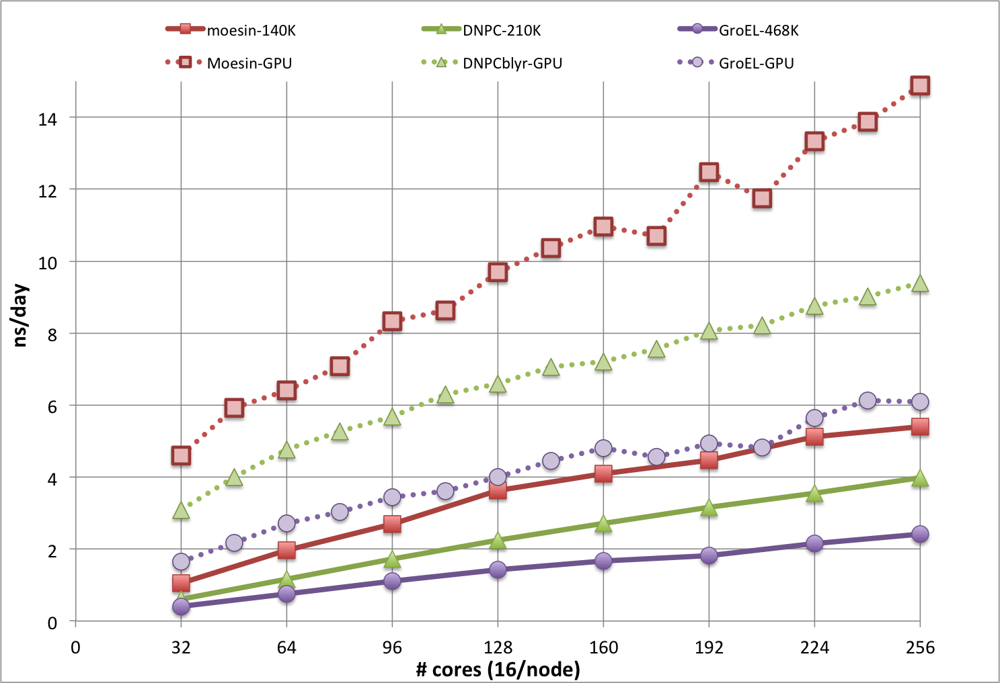

document.querySelector('title').textContent = ' CHARMM on Biowulf ';

CHARMM on Biowulf 


|  |
| --- |
| 
Quick Links
[New CHARMM versions](#update)
[Batch jobs](#batch)
[Using GPUs](#gpus)
[Interactive Usage](#interact)
[Force Field Parameters](#param)
[Other CHARMM resources](#resource)
 |


CHARMM (Chemistry at HARvard Macromolecular Mechanics) [1]:


* A thirty year history, with an emphasis on accuracy and precision,
under the leadership of Nobel prize winner Prof. Martin Karplus
* A versatile and widely used molecular simulation program with broad
application to many-particle systems
* Has been developed with a primary focus on the study of molecules of
biological interest, including peptides, proteins, prosthetic groups, small
molecule ligands, nucleic acids, lipids, and carbohydrates, as they occur in
solution, crystals, and membrane environments
* Provides a large suite of computational tools that encompass numerous
conformational and path sampling methods, free energy estimates, molecular
minimization, dynamics, analysis techniques, and model-building
capabilities
* Can be utilized with various energy functions and models, from mixed
quantum mechanical-molecular mechanical force fields, to all-atom classical
potentials with explicit solvent and various boundary conditions, to implicit
solvent and membrane models


***Major new features in CHARMM 44 and 45:***
* New parameters for lignins added to the carbohydrate force field
* Numeous other force field improvements
* Support for DOMDEC\_GPU on Volta-based GPUs
* DOMDEC may now be used with energy minimization (SD and ABNR) in some circumstances
* REPDSTR is now compatible with DOMDEC, greatly improving the performance of replica exchange simulations.
* New Lennard-Jones PME method (requires a seperate compile time option - contact staff if interested).
* Numerous minor enhancements and bug fixes.


[1] CHARMM: The Biomolecular simulation Program *J. Comp. Chem.* **30,** 1545-1615 (2009).  

[2] New faster CHARMM molecular dynamics engine *J. Comp. Chem.* **35,** 406-413 (2014).

New CHARMM versions!
As of October, 2020, CHARMM version c45b1 has been made available on Biowulf for general use. There
are **important changes** in how to run this version. In particular the "cover scripts"
that were previously used to run CHARMM have been retired. Instead, users must explicitly run
mpirun or srun for parallel runs and call the charmm program directly for serial runs.


For documentation on running CHARMM c42b2 and below with cover scripts, please see
[the documentation for older releases](/apps/charmm/older_charmm.html).


The following modules are available:


* charmm/c45b1/serial: compiled with gcc/7.4.0 and X11 graphics - for use for running serial or interactive jobs; this version support graphics
* charmm/c45b1/domdec: compiled with OpenMPI 4.0.5 and the Intel 2020.2.254 - for use with running parallel dynamics on **CPUs**
* charmm/c45b1/repdstr: compiled with OpenMPI 4.0.5 and the Intel 2020.2.254 - for use with running parallel dynamics **with replica exchange** on **CPUs**
* charmm/c45b1/gpu: compiled with OpenMPI 4.0.5, gcc/7.4.0, and CUDA/10.2 - for running DOMDEC\_GPU on **GPUs**.


SLURM Batch Jobs
For a non-parallel CHARMM job such as model building or ad hoc trajectory analysis, the
commands and setup have few requirements. The job script (build.csh) can be simply:

```

#!/bin/csh
cd $SLURM_SUBMIT_DIR
module load charmm/c45b1/serial

charmm < build-psf.inp >& build-psf.out

```

The above can be submitted to the batch queue via:

```

sbatch build.csh

```


For parallel usage, the following script (sbatch.sh) illustrates submitting a SLURM batch
job which will use the 28 physical cores on each of 4 nodes (112 total cores:

```

#!/bin/bash
#SBATCH --partition=multinode
#SBATCH --time=04:00:00
#SBATCH --ntasks=112
#SBATCH --nodes=4
#SBATCH --ntasks-per-core=1
#SBATCH --constraint="[x2680|x2695]"

module load charmm/c45b1/domdec

srun --mpi=pmix --ntasks=${SLURM_NTASKS} charmm -i input.inp -o output.out

```

The environment variable SLURM\_SUBMIT\_DIR points to the working directory where 'sbatch'
was run, and SLURM\_NTASKS contains the value given with the `--ntasks=` argument
to sbatch. The above is suitable for most parallel CHARMM usage, other than the
DOMDEC\_GPU code (see below).


Note that it is possible to specify sbatch parameters on the command line rather
than in the batch script itself. Command line parameters override those specified within the
batch script. E.g. sbatch --ntasks=56 --nodes=2 --ntasks-per-core=1 --partition=multinode sbatch.sh
would submit the job to 2 nodes via the command line.


Using GPUs
The DOMDEC\_GPU code may be used by using the **charmm/c45b1/gpu** module. DOMDEC\_GPU
uses both an MPI library (OpenMPI in this case) and OpenMP threads, and therefore requires 
changes to the SLURM **sbatch** arguments. The changes are shown in the example below (sbatchGPU.csh); 


```

#!/bin/bash
#SBATCH --partition=gpu
#SBATCH --ntasks=1
#SBATCH --cpus-per-task=8
#SBATCH --gres=gpu:k80:1
#SBATCH --time=4:00:00

export OMP_NUM_THREADS=$SLURM_CPUS_PER_TASK

module load charmm/c45b1/gpu

srun --mpi=pmix --ntasks=$SLURM_NTASKS --cpus-per-task=$SLURM_CPUS_PER_TASK charmm -i input.inp -o output.out

```

This script runs DOMDEC\_GPU on a single Biowulf K80 GPU and can be submitted with sbatch sbatchGPU.sh.
As with the CPU script, arguments can be given on the command line rather than in the script. Remember to modify
the wall time as needed!


Interactive Usage
For a variety of tasks such as model building, analysis, and graphics, foreground interactive use
of CHARMM can be advantageous, esp. when developing and testing a new input script. The SLURM
**sinteractive** command makes this fairly easy (system prompts in **bold**, user input in *italics*):

```

 **biowulf /<2>EwaldNVE [69]** *sinteractive*
salloc.exe: Granted job allocation 1693180
salloc.exe: Waiting for resource configuration
salloc.exe: Nodes cn0032 are ready for job

 **cn0032 /<2>EwaldNVE [1]** *module load charmm/c45b1/serial*
 **cn0032 /<2>EwaldNVE [2]** *charmm < build-psf.inp >& build-psf.out*
 **cn0032 /<2>EwaldNVE [3]** *exit*
exit
salloc.exe: Relinquishing job allocation 1693180
salloc.exe: Job allocation 1693180 has been revoked.

```


For troubleshooting, it may be useful to pipe the output, and both save it in file (via 'tee') and view it in the 'less' browser, e.g.:

```

 **cn0254 /<2>EwaldNVE [3]** charmm < minmodel.inp |& tee minmodel.out | less

```

Finally, CHARMM itself can be run interactively, via simply:

```

 **biowulf /<2>EwaldNVE [71]** *sinteractive*
salloc.exe: Granted job allocation 1693592
salloc.exe: Waiting for resource configuration
salloc.exe: Nodes cn0103 are ready for job

 **cn0103 /<2>EwaldNVE [1]** *module load charmm/c45b1/serial*
 **cn0103 /<2>EwaldNVE [2]** *charmm*

                 Chemistry at HARvard Macromolecular Mechanics
           (CHARMM) - Developmental Version 45b1     August 15, 2020
                                Revision unknown
       Copyright(c) 1984-2020  President and Fellows of Harvard College
                              All Rights Reserved
   Current operating system: Linux-3.10.0-862.14.4.el7.x86_64(x86_64)@cn0858
                 Created on 10/15/20 at 11:58:24 by user: btmiller

            Maximum number of ATOMS:    360720, and RESidues:      120240

```

At this point the program is expecting input, starting with a title; it is recommended to type `bomlev -1`
as the first command, as that will forgive typing errors and allow the program to continue. It also recommended
to have the initial setup commands (reading RTF and PARAM files, PSF and COOR files, etc.) in a 'stream' file, so
that those actions can be done vie e.g.

```

stream init.str

```

The same applies to other complex setups, such as establishing restraints, or graphics setup.
Note that the graphics uses X11, so the initial login to biowulf should use either the -X or the -Y
option of the ssh command or use NoMachine, to enable X11 tunneling for the graphics display.

Force Field Parameters
Recent versions of the distributed CHARMM parameters, including the latest release, are 
available in `/usr/local/apps/charmm` as subdirectories `topparYYYY` where YYYY is the release year.
Each release contains a number of corrections and additions from the past year, esp. for the CHARMM force
fields. The toppar2017 and later releases uses a newer format, so one should be careful about using it with older PSF files.
Files distributed with models built using CHARMM-GUI now use this newer format.

Benchmarks
The plot below is from CHARMM benchmarks run during the beta test phase of Biowulf, and shows results
for DOMDEC on Infiniband nodes (solid lines) and DOMDEC\_GPU on **gpu** nodes (dotted lines), for
even numbers from 2 through 16 nodes. The timings in ns/day are from short MD simulations, run with
a 1 fs integration time step, for 3 molecular systems of different sizes and shapes:* **moesin**; 140K atoms; aqueous protein and lipid bilayer in a tetragonal unit cell, with c > a=b (tall)
* **DNPC**; 210K atoms; aqueous pure DNPC (24:1 chains) bilayer in a tetragonal unit cell, with a=b > c (short)
* **GroEL**; 468K atoms; aqueous GroEL assembly in a cubic unit cell, a=b=c



Note that the ns/day rate would be doubled with the use of a 2 fs time step, which is often done for more
exploratory sampling, but not necessarily recommended for the best accuracy and precision. Simulations
systems that cannot use DOMDEC will be somewhat slower, and will not scale well past about 64 cores.
Other CHARMM resources
* [**CHARMM.org**](http://www.charmm.org) Homepage* [**Harvard University**](http://charmm.chemistry.harvard.edu/) CHARMM Website* [**Tutorial**](http://www.charmmtutorial.org) Wiki* [**Force Fields**](http://mackerell.umaryland.edu/charmm_ff.shtml) From Alex MacKerell* [**ParamChem**](https://cgenff.paramchem.org/) Using CGenFF to add new molecules * [**CHARMM-GUI;**](http://www.charmm-gui.org/) model building, esp. membrane systems* [**CHARMMing;**](http://www.charmming.org/charmming/) learning site, emphasis on QM/MM, redox


---


**The CHARMM program is provided and maintained on Biowulf with the assistance of the NHLBI
 [Laboratory of Computational Biology](http://www.lobos.nih.gov/lcb/index.shtml)**


---


CHARMM on Biowulf /  [Rick\_Venable@nih.gov](mailto:Rick_Venable@nih.gov)  and [staff@hpc.nih.gov](mailto:staff@hpc.nih.gov)


