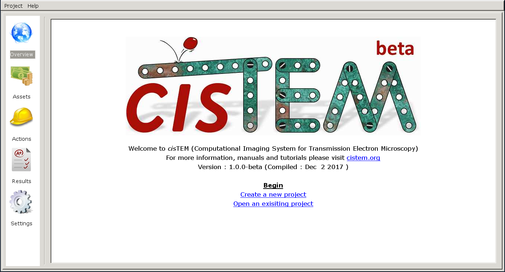
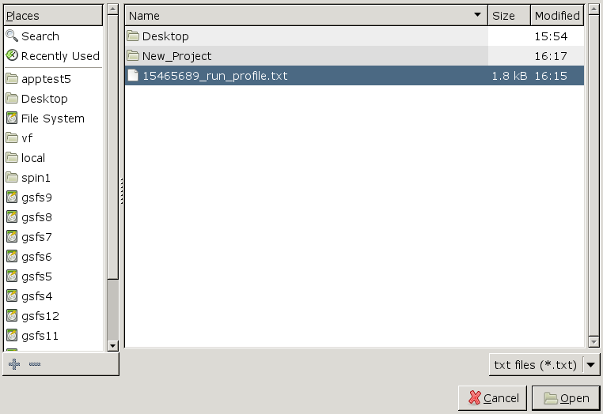
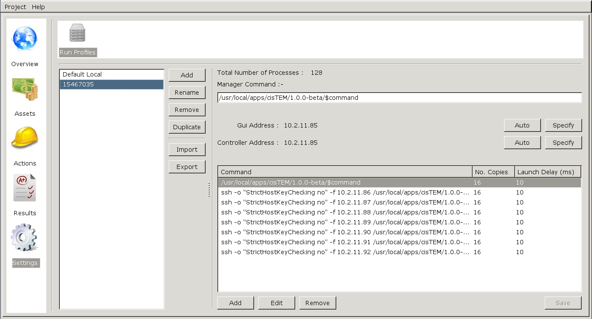

document.querySelector('title').textContent = 'cisTEM on Biowulf';
cisTEM on Biowulf


|  |
| --- |
| 
Quick Links
[Documentation](#doc)
[Notes](#notes)
[Interactive job](#int) 
 |


cisTEM is user-friendly software to process cryo-EM images of macromolecular complexes and obtain high-resolution 3D reconstructions from them.


### References:


* Grant T, Rohou A, Grigorieff N. 
 [**cisTEM, user-friendly software for single-particle image processing.**](https://www.ncbi.nlm.nih.gov/pubmed/29513216)
*Elife. 2018 Mar 7;7.*


Documentation
* [cisTEM Main Site](https://cistem.org/)
* [cisTEM Forum](https://cistem.org/forum)
* [cisTEM Tutorial](cisTEM_tutorial.pdf)


Important Notes
* Module Name: cisTEM (see [the modules page](/apps/modules.html) for more information)
* Distributed using ssh and TCP sockets
* Example files in /fdb/app\_testdata/cryoEM/cisTEM/


cisTEM is a **beta release**. The program may crash for unknown reasons. Please submit issues to the cisTEM Forum.


Interactive use of cisTEM requires a  [graphical X11 connection](https://hpc.nih.gov/docs/connect.html).NX and XQuartz work reasonably well.


Interactive job
[Interactive jobs](/docs/userguide.html#int) should be used for debugging, graphics, or applications that cannot be run as batch jobs.
**There are a few very big problems with running cisTEM on the Biowulf cluster!!**


* Tasks launched from the GUI will crash prematurely if the GUI is ended before the jobs. That means all cisTEM tasks **must complete before the interactive session times out**.
* GPUs are ***not supported***, making cisTEM actions run much longer than RELION jobs.
* Very large jobs with hundreds of tasks will overwhelm the TCP network, and create communication bottlenecks.


The NIH staff has made available a special QOS for allocating an interactive session for longer than normal. From within an NX or XQuartz session, allocate a minimal allocation for 5 days:


```

[user@biowulf]$ **sinteractive --qos=cistem --time=5-00:00:00**
...
[user@cn3144 ~]$

```

Access to the cistem QOS is only by request. Please contact staff@hpc.nih.gov to be granted access.


Start a cisTEM job on the batch system with appropriate allocations:


```

[user@cn3144 ~]$ **sbatch -p multinode -t 1-00:00 -n 32 --mem-per-cpu=2g -J cisTEM --wrap="ml cisTEM; start\_cisTEM"**
15465689

```

**NOTES:**


* Depending on the number of micrographs, you may need more than 32 tasks (**-n 32**). The value can be increased to lower the amount of time required, but should not exceed 512.
* You may require more than 2g per cpu. For larger particles or micrographs, set **--mem-per-cpu** to 4g or 8g.
* You may require more than 1 day of walltime (**-t 1-00:00**). Keep in mind that you can run multiple batch cisTEM jobs in the time span of the interactive session.
* Take note of the jobid given to the cisTEM job (15465689 in the above example). This number will become part of the generated run profile text file (below).
* It is possible to launch multiple batch cisTEM jobs simultaneously from the interactive session, but each must only run with its own unique run profile.


Once the batch job begins running, the CisTEM GUI will pop up:



Click on 'Create a new project', fill in the boxes, then click 'Settings', then 'Import'. There should be a file whose name matches the jobid (noted above). This is the **run profile text file**:


```

[user@cn3144 ~]$ **ls \*.txt**
15465689_run_profile.txt

```


Click 'Open'. Now you have a custom run profile specifically for the current batch job:



Any tasks run within CisTEM using this run profile will launch commands across the cpus allocated in the batch job.


