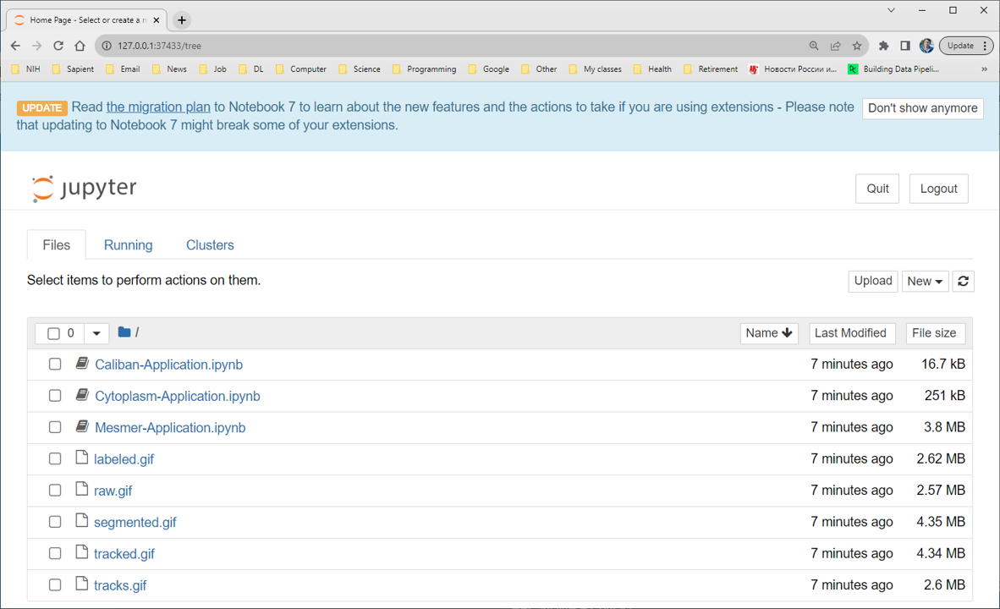

document.querySelector('title').textContent = 'funannotate: a pipeline for genome annotation ';
**DeepCell-tf: a deep learning library for single-cell analysis of biological images.** 


|  |
| --- |
| 
Quick Links
[Documentation](#doc)
[Notes](#notes)
[Interactive job](#int) 
[Batch job](#sbatch) 
[Swarm of jobs](#swarm) 
 |


The DeepCell-tf library allows users to apply pre-existing models to imaging data 
as well as to develop new deep learning models for single-cell analysis. 
The library specializes in models for cell segmentation (whole-cell and nuclear) in 2D and 3D images 
as well as cell tracking in 2D time-lapse datasets. 
The models are applicable to data ranging from multiplexed images of tissues to dynamic live-cell imaging movies.


### References:


* Noah F. Greenwald , Geneva Miller, Erick Moen, ..., Michael Angelo and David Van Valen,   

*Whole-cell segmentation of tissue images with human-level performance using large-scale data annotation and deep learning,*   

[Nature Biotechnology, vol.40, pp. 555–565](https://www.nature.com/articles/s41587-021-01094-0)
* David A. Van Valen, Takamasa Kudo, Keara M. Lane, ..., Euan A. Ashley, Markus W. Covert,   

*Deep Learning Automates the Quantitative Analysis of Individual Cells in Live-Cell Imaging Experiments,*    

[PLOS Computational Biology | DOI:10.1371/journal.pcbi.1005177 November 4, 2016](https://journals.plos.org/ploscompbiol/article?id=10.1371/journal.pcbi.1005177)


Documentation
* [DeepCell-tf Github page](https://github.com/vanvalenlab/deepcell-tf)
* [DeepCell-tf Segmentation manual](https://deepcell.readthedocs.io/en/master/notebooks/Training-Segmentation.html)
* [DeepCell-tf Tracking manual](https://deepcell.readthedocs.io/en/master/notebooks/Training-Tracking.html)


Important Notes
* Module Name: deepcell-tf (see [the modules page](https://hpc.nih.gov/apps/modules.html) for more information)
* Unusual environment variables set
	+ **DEEPCELLTF\_HOME**  installation directory
	+ **DEEPCELLTF\_BIN**    executables directory
	+ **DEEPCELLTF\_SRC**    source code directory
	+ **DEEPCELLTF\_DATA**    sample input data directory


Interactive job
[Interactive jobs](/docs/userguide.html#int) should be used for debugging, graphics, or applications that cannot be run as batch jobs.
  


```

[user@biowulf]$ **sinteractive --mem=8g -c4 \
 --gres=gpu:p100,lscratch:10 \
 --tunnel**

```

Store the $PORT1 value provided by this command.

```

[user@cn0861 ~]$ **cd /lscratch/$SLURM\_JOB\_ID**
[user@cn0861 ~]$ **module load deepcell-tf** 
[+] Loading singularity  3.10.5  on cn0793
[+] Loading jupyter
[+] Loading deepcell-tf  0.12.6
[user@cn0861 ~]$ **git clone https://github.com/vanvalenlab/deepcell-tf** 
[user@cn0861 ~]$ **cd deepcell-tf/notebooks/applications** 

```

Use here the $PORT1 value you tored previously:

```

[user@cn0861 ~]$ **jupyter notebook --ip localhost --port $PORT1 --no-browser**

```

Store the URL provided by the latter command   

On your local system (PC or Mac), open a new shell/terminal window and use it to run the command:

```

[user@cn0861 ~]$ **ssh -L $PORT1:localhost:$PORT1 user@biowulf.nih.gov** 

```

Navigate a browser on your local system to the URL you stored.   





In the browser, click on one on notebook files
etc.: you can pretty much follow the instructions for running Jupyter notrebook: https://hpc.nih.gov/apps/jupyter.html

```

[user@cn0861 ~]$ **exit**
salloc.exe: Relinquishing job allocation 46116226

```


