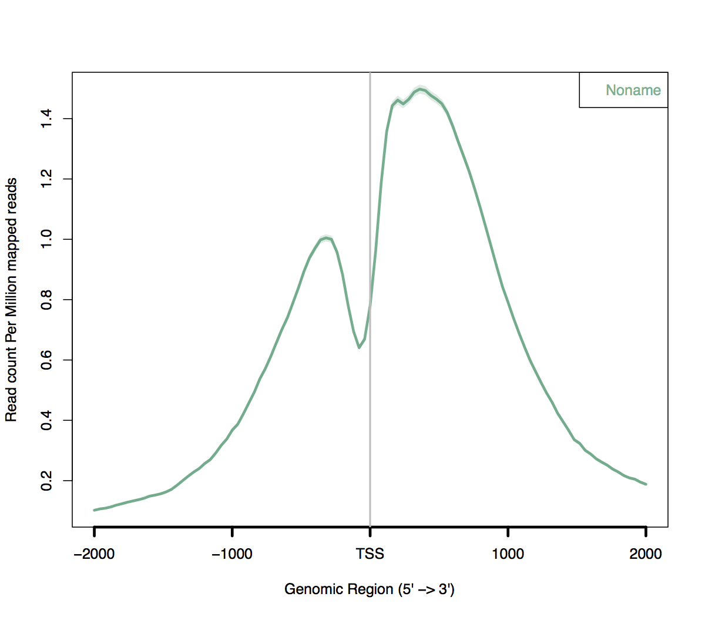

document.querySelector('title').textContent = 'ngsplot on Biowulf';
ngsplot on Biowulf


|  |
| --- |
| 
Quick Links
[Documentation](#doc)
[Notes](#notes)
[Interactive job](#int) 
[Batch job](#sbatch) 
[Swarm of jobs](#swarm) 
 |


ngsplot is an easy-to-use global visualization tool for next-generation sequencing data.


### References:


* Shen L, Shao N, Liu X and Nestler E.
 [**ngs.plot: Quick mining and visualization of next-generation sequencing data by integrating genomic databases.**](http://www.ncbi.nlm.nih.gov/pmc/articles/pmid/24735413/)
*BMC Genomics, 15, 284 (2014).*


Documentation
* <https://code.google.com/p/ngsplot/>


Important Notes
* Module Name: ngsplot (see [the modules page](/apps/modules.html) for more information)
* Multithreaded
* Environment variables set 
	+ NGSPLOT\_HOME
	+ NGSPLOT\_EXAMPLES* Example files in NGSPLOT\_EXAMPLES


Memory Errors
-------------


When ngsplot is run without adequate memory allocation, you may get the following errors:


```

Error: dims [product 89082] do not match the length of object [0]

```

or


```

Error in (result.matrix + result.pseudo.rpm)/(bkg.matrix + bkg.pseudo.rpm) :

```

Typically ngsplot will require at least 4gb of memory.


Interactive job
[Interactive jobs](/docs/userguide.html#int) should be used for debugging, graphics, or applications that cannot be run as batch jobs.
Allocate an [interactive session](/docs/userguide.html#int) and run the program.   
Sample session (user input in **bold**):


```

[user@biowulf]$ **sinteractive --cpus-per-task=8 --mem=20g**
salloc.exe: Pending job allocation 46116226
salloc.exe: job 46116226 queued and waiting for resources
salloc.exe: job 46116226 has been allocated resources
salloc.exe: Granted job allocation 46116226
salloc.exe: Waiting for resource configuration
salloc.exe: Nodes cn3144 are ready for job

[user@cn3144 ~]$ **module load ngsplot**
[user@cn3144 ~]$ **cp $NGSPLOT\_EXAMPLES/\* .**
[user@cn3144 ~]$ **ngs.plot.r -G hg19 -R tss -C hesc.H3k4me3.1M.bam -O k4.test -P $SLURM\_CPUS\_PER\_TASK**
Loading R libraries.....Done
Configuring variables...Done
Analyze bam files and calculate coverage............................................................................................................................................................................................................................................Done
Plotting figures...Done
Saving results...Done
Wrapping results up...Done
All done. Cheers!
[user@cn3144 ~]$ **ls \*.pdf**
hesc.H3k4me3.tss.avgprof.pdf  hesc.H3k4me3.tss.heatmap.pdf
[user@cn3144 ~]$ **display hesc.H3k4me3.tss.avgprof.pdf**
[user@cn3144 ~]$ **exit**
salloc.exe: Relinquishing job allocation 46116226
[user@biowulf ~]$

```



Batch job
Most jobs should be run as [batch jobs](/docs/userguide.html#submit).
Create a batch input file (e.g. ngsplot.sh). For example:


```

#!/bin/bash
module load ngsplot
ngs.plot.r -G hg19 -R tss -C hesc.H3k4me3.1M.bam -O hesc.H3k4me3.tss -T H3K4me3 -L 3000 -FL 300 -P $SLURM_CPUS_PER_TASK
```


Submit this job using the Slurm [sbatch](/docs/userguide.html) command.


```
sbatch [--cpus-per-task=#] [--mem=#] ngsplot.sh
```

Swarm of Jobs 
A [swarm of jobs](/apps/swarm.html) is an easy way to submit a set of independent commands requiring identical resources.
Create a swarmfile (e.g. ngsplot.swarm). For example:


```

ngs.plot.r -G hg19 -R tss -C sample1.bam -O sample1.tss -T H3K4me3_1 -L 3000 -FL 300 -P $SLURM_CPUS_PER_TASK
ngs.plot.r -G hg19 -R tss -C sample2.bam -O sample2.tss -T H3K4me3_2 -L 3000 -FL 300 -P $SLURM_CPUS_PER_TASK
ngs.plot.r -G hg19 -R tss -C sample3.bam -O sample3.tss -T H3K4me3_3 -L 3000 -FL 300 -P $SLURM_CPUS_PER_TASK
ngs.plot.r -G hg19 -R tss -C sample4.bam -O sample4.tss -T H3K4me3_4 -L 3000 -FL 300 -P $SLURM_CPUS_PER_TASK

```

Submit this job using the [swarm](/apps/swarm.html) command.


```
swarm -f ngsplot.swarm [-g #] [-t #] --module ngsplot
```

where


|  |  |  |  |  |  |
| --- | --- | --- | --- | --- | --- |
| -g *#*  Number of Gigabytes of memory required for each process (1 line in the swarm command file)
 | -t *#* Number of threads/CPUs required for each process (1 line in the swarm command file).
 | --module ngsplot Loads the ngsplot module for each subjob in the swarm 
 | |
 | |
 | |


