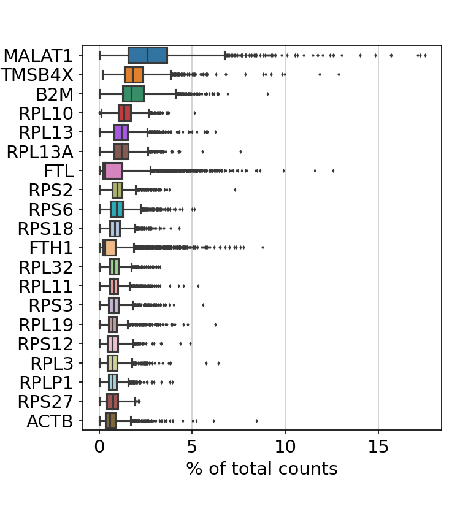
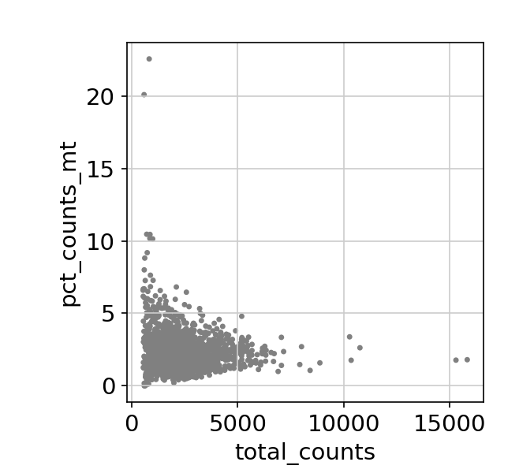
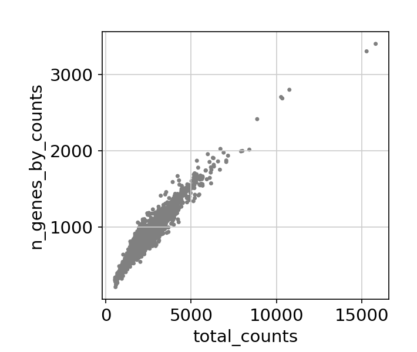
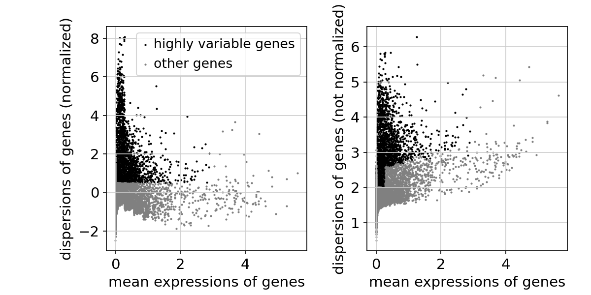

document.querySelector('title').textContent = 'Scanpy on Biowulf';
Scanpy on Biowulf


|  |
| --- |
| 
Quick Links
[Documentation](#doc)
[Notes](#notes)
[Interactive job](#int) 
[Batch job](#sbatch) 
 |


Scanpy is a scalable toolkit for analyzing single-cell gene expression data. It includes preprocessing, visualization, clustering, pseudotime and trajectory inference and differential expression testing. The Python-based implementation efficiently deals with datasets of more than one million cells.


### References:


* Wolf FA, Angerer P, Theis FJ.
 [SCANPY: large-scale single-cell gene expression data analysis.](https://www.ncbi.nlm.nih.gov/pubmed/29409532)
Genome Biol. *2018 Feb 6;19(1):15.*


Documentation
* [Scanpy Main Site](https://scanpy.readthedocs.io/en/latest/index.html#)
* [Scanpy Documentation](https://scanpy.readthedocs.io/en/stable/tutorials.html)


Important Notes
* Module Name: scanpy (see [the modules page](/apps/modules.html) for more information)
* Multithreaded/singlethreaded
* Example files in $SCANPY\_EXAMPLES


This application contains graphical content and requires an [X-Windows connection](https://hpc.nih.gov/docs/connect.html). It is primarily meant to be run via [Jupyter notebooks](https://hpc.nih.gov/apps/jupyter.html).


Interactive job
[Interactive jobs](/docs/userguide.html#int) should be used for debugging, graphics, or applications that cannot be run as batch jobs.
Allocate an [interactive session](/docs/userguide.html#int) and run the program.   
Sample session (user input in **bold**):


```

[user@biowulf]$ **sinteractive**
salloc.exe: Pending job allocation 46116226
salloc.exe: job 46116226 queued and waiting for resources
salloc.exe: job 46116226 has been allocated resources
salloc.exe: Granted job allocation 46116226
salloc.exe: Waiting for resource configuration
salloc.exe: Nodes cn0860 are ready for job

[user@cn0860 ~]$ **module load scanpy**
[+] Loading scanpy 1.8.1 on cn0860
[+] Loading singularity  3.8.2  on cn0860
[user@cn0860 ~]$ **cp -r $SCANPY\_DATA/\* .**
[user@cn0860 ~]$ **python cluster.py**
scanpy==1.8.1 anndata==0.7.6 umap==0.5.1 numpy==1.20.3 scipy==1.7.1 pandas==1.3.2 scikit-learn==0.24.2 statsmodels==0.12.2 python-igraph==0.9.6 pynndescent==0.5.4
... reading from cache file cache/data-filtered_gene_bc_matrices-hg19-matrix.h5ad
normalizing counts per cell
    finished (0:00:00)

```



```

filtered out 19024 genes that are detected in less than 3 cells

```





```

/Miniconda/lib/python3.9/site-packages/scanpy/preprocessing/_normalization.py:155: UserWarning: Revieved a view of an AnnData. Making a copy.
  view_to_actual(adata)
normalizing counts per cell
    finished (0:00:00)
extracting highly variable genes
    finished (0:00:00)

```



```

/Miniconda/lib/python3.9/site-packages/scanpy/preprocessing/_simple.py:373: UserWarning: Revieved a view of an AnnData. Making a copy.
  view_to_actual(adata)
regressing out ['total_counts', 'pct_counts_mt']
    sparse input is densified and may lead to high memory use
    finished (0:00:10)

```


```

[user@cn0860 ~]$ **exit**
salloc.exe: Relinquishing job allocation 46116226
[user@biowulf ~]$

```


Batch job
Most jobs should be run as [batch jobs](/docs/userguide.html#submit).
Create a batch input file (e.g. scanpy.sh). For example:


```

#!/bin/bash
module load scanpy
python my_script.py

```

Submit this job using the Slurm [sbatch](/docs/userguide.html) command.


```
sbatch [--cpus-per-task=#] [--mem=#] scanpy.sh
```


