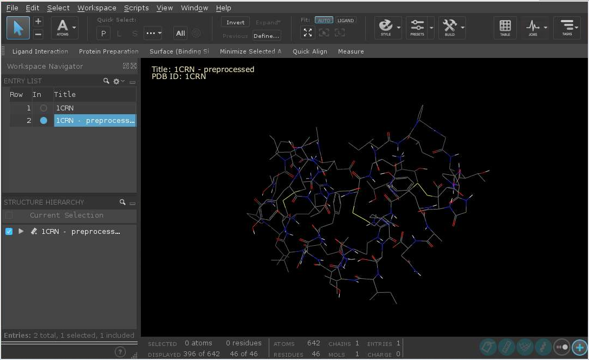
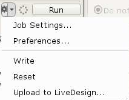
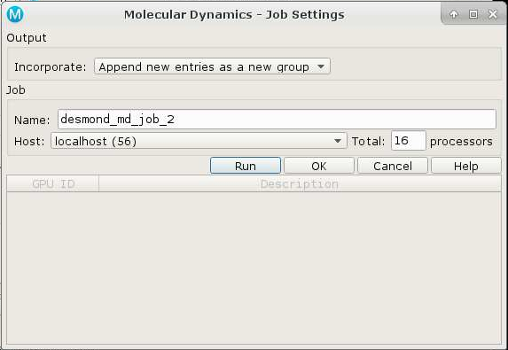
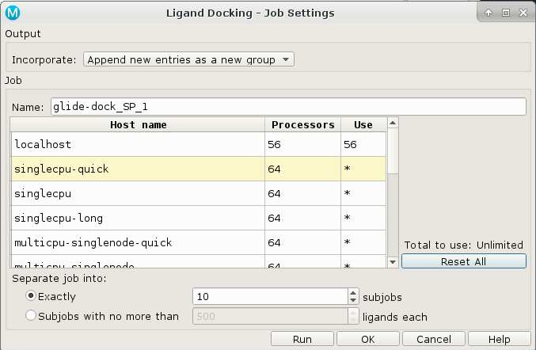
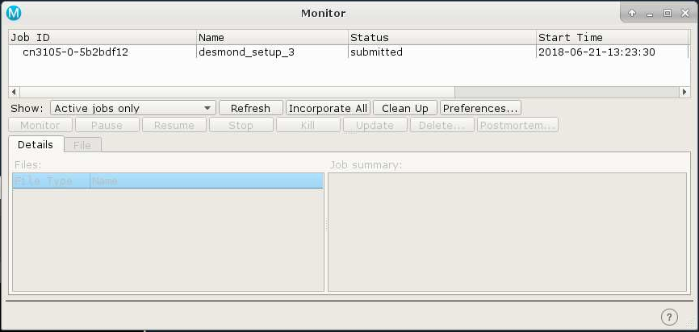

document.querySelector('title').textContent = 'Schr&ouml;dinger on Biowulf';
Schrödinger on Biowulf


|  |
| --- |
| 
Quick Links
[Documentation](#doc)
[Notes](#notes)
[Interactive job](#int) 
[Batch job](#sbatch) 
[Running Desmond](#desmond) 
 |


 We have a limited number licenses for Schrödinger applications
 on the Biowulf cluster. Due to heavy demand, high cost, and limited
 availability, license usage for some applications will be restricted
 in order to ensure fair usage. **In particular, users can run a maximum
 of 12 Glide jobs and 4 Prime jobs at a given time.** 
  
  

**The use
 of Schrödinger applications is limited to intramural NIH users
 only.**
  
  

 Schrödinger applications can be run from the command line, through the
 batch system, and interactively through the Maestro GUI. See the documentation
 link below for more information, particularly the Job Control Guide.


Documentation
* [Online documentation (requires registration)](https://www.schrodinger.com/supportdocs/18/)
* [Schrodinger Presentations and Tutorials given at NIH](https://hpc.nih.gov/apps/schrodinger/presentations/)
* <http://www.schrodinger.com>


Important Notes
* Module Name: **schrodinger** (see [the modules page](/apps/modules.html) for more information)
* Multithreaded/singlethreaded/MPI
* Environment variables set 
	+ SCHRODINGER\_TMPDIR - custom location for temporary files created during jobs
	+ SCHRODINGER\_JOBDB2 - location of the job database, must be a permanent and shared location (e.g. /data/$USER/jobdb2)


Maestro is a graphical, interactive application. It requires a [X11 connection](https://hpc.nih.gov/docs/connect.html).


Local Scratch Disk Space
Schrödinger applications make extensive use of local scratch disk space. These are defined in
two environment variables: **SCHRODINGER\_TMPDIR** and **TMPDIR**. For the best
I/O performance, allocate local scratch space to use, rather than shared space.


For both interactive sessions and batch jobs, including


```
--gres lscratch:***N***
```

will allocate ***N*** GB of local scratch space. Loading the schrodinger module will set
the environment to use this space. The amount of space necessary depends on the jobs to be run; 20GB is
a good minimal value.


**NOTE:** When Schrödinger jobs are submitted to the batch system, a jserver
process is started and run in the background. This jserver process ensures that files created in the
scratch directory are copied and incorporated into the job database. If the jserver process dies before
the submitted job finishes, files in the scratch directory are not copied back and incorporated into
the job database. If the scratch directory is deleted, as will happen when using dynamically allocated
scratch space (/lscratch/$SLURM\_JOB\_ID), **THE FILES ARE LOST**.  
  

Be aware that if a job is launched from an interactive Biowulf session, the remote jobs must finish within
the time allocated to the interactive session, or the results of the jobs launched may be lost.


Interactive job
[Interactive jobs](/docs/userguide.html#int) should be used for debugging, graphics, or applications that cannot be run as batch jobs.
Allocate an [interactive session](/docs/userguide.html#int) and run the program.   
Sample session (user input in **bold**):


```

[user@biowulf]$ **sinteractive --gres=lscratch:50 --cpus-per-task=8**
salloc.exe: Pending job allocation 46116226
salloc.exe: job 46116226 queued and waiting for resources
salloc.exe: job 46116226 has been allocated resources
salloc.exe: Granted job allocation 46116226
salloc.exe: Waiting for resource configuration
salloc.exe: Nodes cn3144 are ready for job

[user@cn3144 ~]$ **module load schrodinger**

[user@cn3144 ~]$ **maestro &**

[user@cn3144 ~]$ **exit**
salloc.exe: Relinquishing job allocation 46116226
[user@biowulf ~]$

```


Due to incompatibilities between the OpenGL/GLX commands given by the Maestro GUI and the X11 server running on your desktop client machine, the interface may hang or crash with errors. If this is the case, Maestro can be run with the -SGL option:


```
[user@cn3144 ~]$ maestro -SGL &
```

Running Locally
For the majority of uses, Schrödinger jobs should be run locally. To do so, make sure that the "Run Settings" host is set to localhost. Right-click on the small downward arrow next to the six-pointed gear near the 'Run' button:



Then choose 'localhost' as the Host:



The number of processors should not exceed the number of CPUs allocated for the job.


Batch job
Most jobs should be run as [batch jobs](/docs/userguide.html#submit).
Schrödinger jobs can be submitted to the Biowulf batch system from the Maestro GUI. In this case, an appropriate host entry should be chosen from those available:



In this case, the number of subjobs equals the number of batch jobs to submit.


After clicking 'Run', the job monitor window will show the job state:



Running Desmond
A free academic version of [Desmond](https://www.deshawresearch.com/resources_desmond.html) has been installed.


**NOTE:** Desmond DOES NOT SCALE BEYOND ONE NODE. Worse, it requires a single core be reserved for monitoring, so the most CPUs you can allocate per node is **54**.


 To use this version, first allocate an interactive session using a [graphical terminal session](https://hpc.nih.gov/docs/connect.html), then load the desmond module and launch maestro:


```
$ **sinteractive**
...
$ **ml desmond**
$ **maestro**
```

Import the molecules and set up the system, then launch the Molecular Dynamics task window. Configure your dynamics job and then click on the gear icon to open the Job Settings panel.
Choose the 'batch' host entry, and select **54 processors -- NOT 56, as this will cause desmond to stall**. **Click 'OK' not 'Run'**. Next click on the icon again, and choose 'Write'. Now quit out of maestro.


Change directories to the subdirectory created by the write function. The subdirectory is the same name as the job. In this example, the name is *desmond\_md\_job\_1*. Edit the script created by maestro like so:


**BEFORE:**

```
"${SCHRODINGER}/utilities/multisim" -JOBNAME *desmond\_md\_job\_1* -HOST batch -maxjob 1 -cpu 54 -m *desmond\_md\_job\_1*.msj -c *desmond\_md\_job\_1*.cfg -description "Molecular Dynamics" *desmond\_md\_job\_1*.cms -mode umbrella -o *desmond\_md\_job\_1*-out.cms -ATTACHED
```

**AFTER:**

```
#!/bin/bash
module load desmond
unset SLURM_JOB_ID
"${SCHRODINGER}/utilities/multisim" -JOBNAME *desmond\_md\_job\_1* -HOST **${SLURM\_JOB\_NODELIST}:54** -maxjob 1 -cpu 54 -m *desmond\_md\_job\_1*.msj -c *desmond\_md\_job\_1*.cfg -description "Molecular Dynamics" *desmond\_md\_job\_1*.cms -mode umbrella -o *desmond\_md\_job\_1*-out.cms -ATTACHED **-WAIT**
sleep 120
```

Then submit to the batch system like so:


```
$ **sbatch --ntasks=1 --ntasks-per-node=56 --nodes=1 --time=60 *desmond\_md\_job\_1*.sh**
```

The amount of time allocated should probably be increased beyond one hour.


